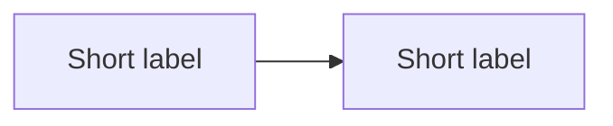

# Agent Instructions

## 1. What This Is

This is Alexander Traykov's Astro portfolio: ASCII terminal language, printed-paper surfaces, vanilla CSS/JS, and Three.js turntables. Do not add dependencies unless the user explicitly asks. The unified design system lives in `src/styles/global.css`; keep it one file.

## 2. Commands And Done

- `npm run verify` must pass.
- `npm run build` must pass cleanly.
- A change is done only when both commands pass and the relevant route has been checked in a browser.

## 3. Repo Map

- `src/pages/` contains the Astro routes.
- `src/components/` contains shared Astro components.
- `src/lib/content.ts` parses frontmatter and renders the custom MDX dialect.
- `src/scripts/motion/` owns reveal, scan, scramble, rise-stagger, blink-adjacent count-up, and scroll effects.
- `src/styles/global.css` owns tokens, layout, components, and responsive rules.
- `case-studies/` contains routable MDX case studies and authoring templates.

## 4. Hard Design Rules

- Use tokens from `:root`; do not hardcode colors, easings, durations, z-indexes, shadows, or spacing in new CSS.
- Corners are square: `--radius-0`. Pills are the only exception.
- Canonical ASCII scramble ramp is `" .:+*#%@"`.
- Canonical breakpoints are 1180, 900, 820, 700, and 640.
- Motion vocabulary is closed: reveal, scan, scramble, rise-stagger, blink. New animation should compose these primitives.
- Reduced motion is a hard contract: readable at rest, no parallax, no forced motion.
- Prefer transform and opacity. Avoid layout-driving animation.
- Per-study identity is allowed through scoped attributes such as `body[data-case-theme="synapse"]`. Synapse card hover is the reference for distinctive identity layered on shared primitives.

## 5. Motion Quickref

- `data-reveal="rise|fade|scan|scramble"` opts an element into the shared IntersectionObserver.
- `data-reveal-delay="120"` sets a millisecond delay.
- `data-reveal-group` staggers direct children by 60ms, capped at six steps.
- `data-scramble` uses the shared ASCII ramp. Use `data-scramble-trigger="hover|reveal|load"` only when the default hover trigger is not right.
- `html[data-motion="ready"]` gates hidden reveal states so no-JS remains fully visible.
- Page-enter owns above-fold motion. Mark above-fold elements in synchronously; avoid double-fire.

## 6. Content Authoring

Frontmatter should include `title`, `summary`, `group`, `category`, `status`, `tags`, `readTime`, and `order` when route order matters. `slugOverrides` in `src/lib/content.ts` is the source for legacy route names.

Custom fences:

````md


```case-video-copy
title: Demo
file: public/case-studies/media/demo.mp4
Caption body.
```

```case-image-grid
title: Gallery
columns: 2
public/path.png | Label | Caption
```

```case-stat title: Evidence
42% | adoption lift | Use real measured signals only.
```

```case-quote
attribution: Product principle
role: Launch review
Quote body.
```
````

Renderer limits: this is a line-based custom renderer. Do not rely on nested lists, tables, or arbitrary HTML passthrough.

## 7. DO NOT TOUCH

- Do not change `content.ts` parse, slug, or heading contracts unless the task is explicitly about the renderer.
- Do not rewrite turntable scripts for unrelated work.
- Do not alter `public/ascii-shader.js` behavior casually.
- Do not change `public/page-transitions.js` timings casually.
- Preserve strings asserted by `scripts/verify-site.mjs`.

## 8. Verification Checklist

- `npm run verify`
- `npm run build`
- Check `/`, `/case-studies/`, `/case-studies/synapse-sys/`, `/case-studies/designing-pave/`, and `/about/`.
- For motion work, test reduced motion and no-JS visibility.
