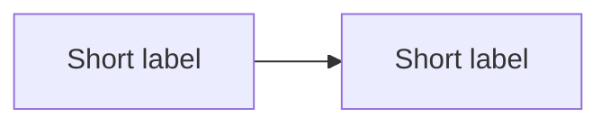

# Agent Instructions

## 1. What This Is

This is Alexander Traykov's Astro portfolio: ASCII terminal language, printed-paper surfaces, vanilla CSS/JS, and Three.js turntables. Do not add dependencies unless the user explicitly asks. The unified design system lives in `src/styles/global.css`; keep it one file.

## 2. Commands And Done

- `npm run verify` must pass.
- `npm run build` must pass cleanly.
- A change is done only when both commands pass and the relevant route has been checked in a browser.

## 3. Repo Map

- `src/pages/` contains the Astro routes.
- `src/components/` contains shared Astro components.
- `src/lib/content.ts` parses frontmatter and renders the custom MDX dialect.
- `src/scripts/motion/` owns reveal, scan, scramble, rise-stagger, blink-adjacent count-up, and scroll effects.
- `src/styles/global.css` owns tokens, layout, components, and responsive rules.
- `case-studies/` contains routable MDX case studies and authoring templates.

## 4. Hard Design Rules

- Use tokens from `:root`; do not hardcode colors, easings, durations, z-indexes, shadows, or spacing in new CSS.
- Corners are square: `--radius-0`. Pills are the only exception.
- Canonical ASCII scramble ramp is `" .:+*#%@"`.
- Canonical breakpoints are 1180, 900, 820, 700, and 640.
- Motion vocabulary is closed: reveal, scan, scramble, rise-stagger, blink. New animation should compose these primitives.
- Reduced motion is a hard contract: readable at rest, no parallax, no forced motion.
- Prefer transform and opacity. Avoid layout-driving animation.
- Per-study identity is allowed through scoped attributes such as `body[data-case-theme="synapse"]`. Synapse card hover is the reference for distinctive identity layered on shared primitives.

## 5. Motion Quickref

- `data-reveal="rise|fade|scan|scramble"` opts an element into the shared IntersectionObserver.
- `data-reveal-delay="120"` sets a millisecond delay.
- `data-reveal-group` staggers direct children by 60ms, capped at six steps.
- `data-scramble` uses the shared ASCII ramp. Use `data-scramble-trigger="hover|reveal|load"` only when the default hover trigger is not right.
- `html[data-motion="ready"]` gates hidden reveal states so no-JS remains fully visible.
- Page-enter owns above-fold motion. Mark above-fold elements in synchronously; avoid double-fire.

## 6. Content Authoring

Frontmatter should include `title`, `summary`, `group`, `category`, `status`, `tags`, `readTime`, and `order` when route order matters. `slugOverrides` in `src/lib/content.ts` is the source for legacy route names.

### Case-study voice

- Write in Alexander's operator voice: technical, opinionated, self-mocking, and grounded in what actually broke. The 2019–2021 essay voice may add vulnerability and visual texture; the more generic 2024 guide voice must not set the sentence-level style.
- Factual truth outranks a satisfying story. Do not invent incidents, motives, quotes, user reactions, metrics, research findings, or embarrassing admissions. If the available material does not support a claim, qualify it, name the gap, or remove it.
- Enter through a concrete incident, decision, or admission when the evidence supports one. Do not open already knowing the lesson or with a generic product-design thesis.
- Make Alexander part of the problem. Show the attractive first belief, the moment reality complicated it, the initial wrong or incomplete explanation, and the concrete detail that changed the interpretation. Do not mechanically force every beat when the record does not contain it.
- Use product mechanics as evidence: exact UI behavior, awkward handoffs, broken states, implementation constraints, research language, scope cuts, and artifacts. Tool or stack names belong only when they explain a product consequence.
- Stay fair to engineers, users, stakeholders, and inherited systems. Criticism should follow self-implication and explain what the supposed antagonist was protecting or responding to.
- Mix developed, clause-heavy paragraphs with blunt interruptions. Use fragments, parenthetical corrections, rough syntax, slang, or profanity only when the story earns them. Do not manufacture quirks or put every sentence on its own line.
- Prefer honest uncertainty over portfolio theatre. Distinguish shipped behavior, prototypes, assumptions, and unmeasured outcomes. Use `case-stat` only for real, attributable signals.
- End with what remains limited, unresolved, irritating, or unproven. Do not turn the ending into a universal lesson, quote-card maxim, or engagement question.
- Rewrite when three or more are true: the opening already knows the conclusion; a tidy reversal arrives before a specific incident; adjacent paragraphs are artificially isolated; the wording is suspiciously symmetrical; Alexander is wiser than everyone from line one; the details could fit any company; the ending is too quotable; or there is no admission that costs Alexander a little pride.
- Keep frontmatter summaries plain and factual. Avoid `unlock`, `drive alignment`, `enable transformation`, `foster innovation`, `at its core`, `the real lesson`, `the key takeaway`, and `this is where leadership begins` unless quoting source material critically.

Custom fences:

````md

```mermaid
flowchart LR
  A[Short label] --> B[Short label]
```

```case-video-copy
title: Demo
file: public/case-studies/media/demo.mp4
Caption body.
```

```case-image-grid
title: Gallery
columns: 2
public/path.png | Label | Caption
```

```case-stat title: Evidence
42% | adoption lift | Use real measured signals only.
```

```case-quote
attribution: Product principle
role: Launch review
Quote body.
```
````

Renderer limits: this is a line-based custom renderer. Do not rely on nested lists, tables, or arbitrary HTML passthrough.

## 7. DO NOT TOUCH

- Do not change `content.ts` parse, slug, or heading contracts unless the task is explicitly about the renderer.
- Do not rewrite turntable scripts for unrelated work.
- Do not alter `public/ascii-shader.js` behavior casually.
- Do not change `public/page-transitions.js` timings casually.
- Preserve strings asserted by `scripts/verify-site.mjs`.

## 8. Verification Checklist

- `npm run verify`
- `npm run build`
- `npm run check:browser`
- Check `/`, `/case-studies/`, `/case-studies/synapse-sys/`, `/case-studies/designing-pave/`, and `/about/`.
- For motion work, test reduced motion and no-JS visibility.

## 9. Agent Harness Execution Protocol

- Preserve or snapshot a dirty worktree before implementation; never stash, reset, or overwrite user changes automatically.
- Keep Sol High as the primary orchestrator. Give one Luna Max or Terra Max implementer an exact five-part contract and never run parallel writers.
- Use Luna for clear, bounded work. Use Terra for shared CSS/motion, routing/renderer, WebGL, contact/security, cross-cutting browser work, or a failed Luna task.
- Inspect the worker's actual diff and rerun verification. `npm run check` is the full deterministic handoff gate; audits are advisory.
- Close the implementer before the fresh Sol High `portfolio_reviewer`. Record status before and after review because runtime permissions can broaden requested read-only access.
- Codex findings are advisory. A human owns merge decisions; do not use automatic model fixes or merges.

## Code Review Rules

### Renderer and slug compatibility

- Flag changes that break line-based headings, custom fences, frontmatter parsing, canonical slugs, or legacy route compatibility.
  Safe path: preserve existing parser output and wire names; add backward-compatible `slugOverrides` or aliases and test canonical plus legacy routes.

### Token and motion compatibility

- Flag new hardcoded visual values or motion outside the existing token and reveal/scan/scramble/rise-stagger/blink vocabulary.
  Safe path: reuse `:root` tokens and shared motion primitives; layer study-specific identity under a scoped body attribute.

### No-JS and reduced-motion rest state

- Flag content hidden without JavaScript, reveal content hidden at reduced motion, active reduced-motion parallax, or WebGL without readable fallback content.
  Safe path: gate hidden reveal states through `html[data-motion="ready"]`, expose content at rest, zero scroll effects, and preserve the fallback.

### Asserted behavior and strings

- Flag changes that silently invalidate behavior or strings protected by `scripts/verify-site.mjs`.
  Safe path: preserve the asserted contract, or change the implementation and its assertion together only when the owner explicitly changes that contract. Leave mechanical enforcement in CI.
