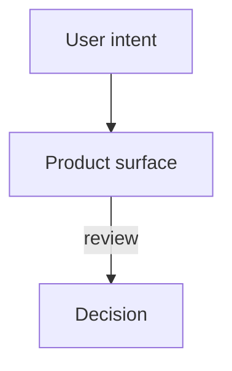

# Case Studies

Portfolio-grade writeups of the design decisions behind each feature in the Pave design playground. One study per page, one per major composite.

Each study captures **what problem** the surface solves, **what options** were on the table, **what we chose and why**, and the **tradeoffs** we accepted. Screenshots (light + dark) are captured by a dedicated Playwright script and live alongside the prose.

This folder is **gitignored** — these are author-voice narratives, not product docs.

---

## Reading order

Start here if you want the core narrative arc:

1. [Designing Pave](./pages/designing-pave.mdx) — product surfaces: workflow builder, direct edit, motion, billing, rebrand
2. [Building Pave](./pages/building-pave-environment.mdx) — environment: tokens, agents, CI, branch previews, handoff grammar
3. [Home](./pages/01-home.mdx) — landing surface, how we introduce the product
4. [Builder](./pages/02-builder.mdx) — flagship AI-driven canvas
5. [ChatWindow](./composites/chat-window.mdx) — conversational surface inside Builder
6. [InspectorCanvas](./composites/inspector-canvas.mdx) — visual-edit overlay that makes AI output editable

Then branch by area:

- **Data model**: [Tables](./pages/04-tables.mdx) → [Relationships](./pages/05-relationships.mdx)
- **Content creation**: [TemplateEditor](./pages/07-template-editor.mdx) + [TemplateEditor composite](./composites/template-editor.mdx)
- **Billing / credits**: [Pricing](./pages/17-pricing.mdx) → [Checkout](./pages/18-checkout.mdx) → [CheckoutModal](./composites/checkout-modal.mdx) → Credit system composites
- **Settings surface**: [Themes](./pages/06-themes.mdx), [Notifications](./pages/08-notifications.mdx), [Permissions](./pages/10-permissions.mdx), [Settings](./pages/11-settings.mdx), [Users](./pages/12-users.mdx), [Account](./pages/09-account.mdx)
- **Auth**: [Login](./pages/15-login.mdx)
- **Internals**: [DesignQA](./pages/13-design-qa.mdx), [ComponentPreview](./pages/14-component-preview.mdx), [PaveStyleGuide](./pages/16-pave-styleguide.mdx)

---

## Template

All studies follow [`_template.mdx`](./_template.mdx). Sections are fixed; prose is not.

---

## Diagram Rendering Pipeline

Author diagrams in the case-study MDX as fenced Mermaid blocks:

````

````

At site render time, `src/lib/content.ts` detects `mermaid` / `diagram` fences and converts supported Mermaid shapes into RFC-style ASCII diagrams:

- `flowchart` / `graph` for product flows, state ladders, layout maps, and subgraph group labels.
- `stateDiagram-v2` for lifecycle diagrams and state notes.
- `sequenceDiagram` for user/system handoffs.

The output remains static HTML: `<div class="ascii-diagram rfc-diagram">…</div>`. Styling lives in `src/styles/global.css`, where diagrams use Geist Mono, paper-white panels, black dashed boxes, uppercase labels, CSS arrow plumbing, and dot-matrix offset shadows inspired by printed technical RFC diagrams. If a Mermaid shape is outside the supported parser, the renderer falls back to a code block rather than dropping the diagram.

Font decision: the site uses Geist Sans for text and Geist Mono for ASCII diagrams, code-like labels, and navigation. Both families are bundled through Fontsource imports in `src/styles/global.css`.

---

## Screenshots

Captured via dedicated Playwright spec at `tests/case-studies/capture.spec.ts`.

```bash
bun run case-studies:capture
```

Outputs land in `case-studies/screenshots/pages/` and `case-studies/screenshots/composites/`, overwriting prior captures. Light + dark pairs for every feature; state-specific shots for composites.

The capture script:
- Launches the existing Vite dev server (port 5173).
- Uses the same `enableDarkMode` helper as `tests/visual/`.
- Viewport: 1440×900 (desktop reference).
- Animations disabled at capture time (tokens still apply, motion does not).

Re-run the script whenever a feature changes visually. The `_research/` sibling folder holds raw agent outputs for each study — useful when you want to refactor a narrative later.

---

## Source docs referenced

Each study cites canonical source material from:

- `docs/handoffs/` — engineer specs
- `docs/previews/` — PM briefs
- `docs/prd-pm-pd/` — research, vision, living artifacts
- `docs/diagrams/` — Mermaid flows
- `docs/audits/` — compliance audits
- `motion-guidelines/` — motion philosophy and technical rules
