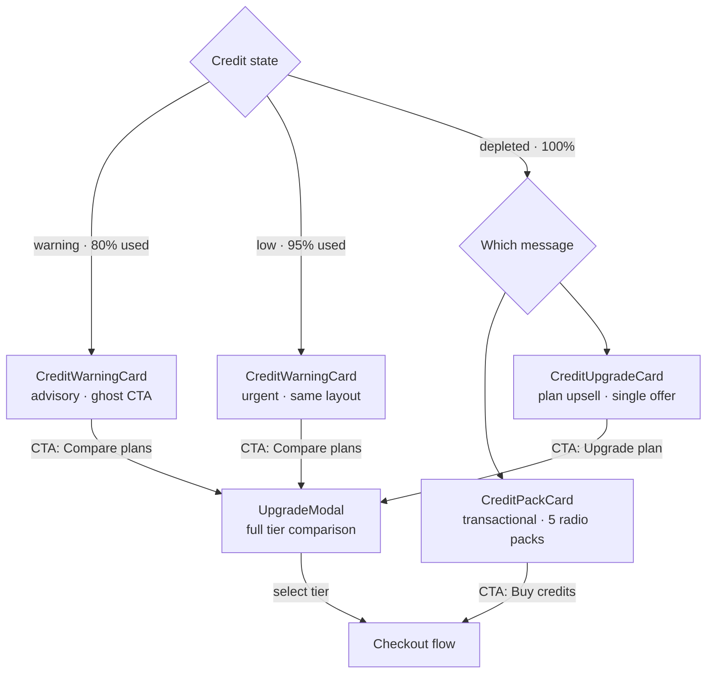
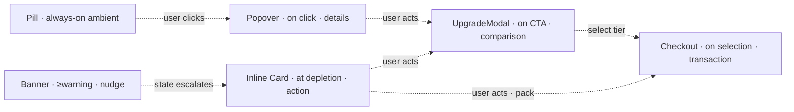

import { CreditPillPreview, CreditBannerPreview } from '@/case-study-previews';

## The one-liner

When a user runs out of credits, the conversion surface doesn't open a modal or redirect to a pricing page. It *appears as a typed message inside their chat thread* — right there, next to the conversation that got them stuck. Depletion is an interruption to be resolved in place, not a billing event to be navigated to.

## About the product

Pave is an AI-native app builder with a credits-based pricing model. Billing PLG is the system that handles the depletion → upgrade moment — the conversion surface. I designed the three-card escalation ladder, the split between "add more" and "upgrade" CTAs, and the copy that frames depletion as help rather than a paywall.

## How I framed the problem

Depletion is a failure moment for the user. They were in flow — asking the AI to build something — and now they can't. Standard industry patterns handle this badly:

- **Modal over everything**: feels like a paywall; destroys the conversation context.
- **Redirect to pricing**: costs navigation; a user who clicks back may lose their unsent message or thread state.
- **Banner only**: low-friction, but insufficient for users who actually need to buy.

A 12-platform competitive audit found zero precedent for pricing-page redirects in credit replenishment. Every competitor either redirects or blocks; none let the user solve the interruption inside the conversation they were having.

I wanted the conversion surface to feel like *help arriving*, not aggression. That's a motion choice and a copy choice and a geometry choice, all working together.

## The shape I landed on

Three cards with three distinct commitment shapes:

**CreditWarningCard** — advisory. Horizontal single-row layout with a 3px accent bar as the signal carrier. Ghost CTA. Copy: *"Nearing build credit limit."* The card opens a comparison modal for tier comparison.

**CreditPackCard** — transactional. Vertical zone stack. Five-pack radio picker from Starter $20 to Max $1000. Pre-selected on the middle tier — anchoring bias is well-documented and deliberate. Primary CTA: *"Buy credits."* One-time top-up, no tier change.

**CreditUpgradeCard** — plan upsell. Single-offer card. No picker — the decision is collapsed to one CTA. Solid fill. Dismissible but not obviously.

Copy escalates in parallel: *"80% used"* → *"Out of credits, choose an amount"* → *"You're out of credits, here's the plan."*

<CreditPillPreview client:visible />

<CreditBannerPreview client:visible />

## Elegant bits

- **Cards live inside the chat thread as typed messages.** Not overlays, not slide-ins — actual entries in the messages array, rendered inline with the conversation. They scroll with the thread, they're part of the audit trail, and a user who bought credits yesterday can scroll back and see it. Conversion stays in the conversation.
- **CTA responsibility is split.** *"Add more"* is the immediate-relief action; *"Upgrade"* is the considered decision. Warning cards have the ghost-CTA path (compare plans); pack cards have the purchase path (add more). This is documented as a formal responsibility split — the product's answer to two different user cognitive modes.
- **No fake urgency.** The renewal countdown never masquerades as an offer-expiry timer. The team flags this as an anti-pattern actively policed out of copy review.
- **Middle pack pre-selected.** $100 (Power) is the default choice, not Starter. This is anchoring — users typically keep the default unless they have a reason to change it, and the middle tier is the best revenue-per-unit for this product shape.
- **The pill and banner coexist without double-signaling.** The pill is always-on ambient state (glanceable, color-coded). The banner is textual and appears on state transition (readable, dismissible except at depleted). They operate at different registers — so when both are visible at depleted, each is doing distinct work.
- **"Building is paused. Apps keep running."** First line of the depleted copy. It resolves the user's primary anxiety (are my published apps broken?) before asking anything of them.

## The escalation ladder

Each rung has a specific job. No rung is optional. A user can ignore the pill, dismiss the banner, scroll past the card — and if they come back, the banner will have re-escalated and the chain still works.

## Motion + craft

- **Card enter**: decelerate ease, 6–12px y-offset, 250ms. Reads as *settling* rather than dropping. "Help arriving," not aggression.
- **Enter-from-above orb glows on warning cards** for the amber/orange state.
- **UpgradeModal** uses a dialog primitive. Focus trap and Escape handled for free. Overlay scrim enters independently from the panel.
- **Banner dismiss persists in-memory only.** Dismissal tracks the severity it was dismissed at; state escalation overrides dismissal. A user who dismissed at warning and dropped to low sees the banner re-appear.
- **Every enter has an exit.** Presence machinery on all animated surfaces. Reduced-motion gates throughout.

## Screenshots

## What I gave up

- **The credit-pack purchase path isn't fully wired.** The "Buy" button on the pack card and the "+ Upgrade" button on the upgrade card don't have handlers in the prototype. Upgrade-via-tier-modal works end-to-end; direct pack purchase doesn't.
- **Two unreconciled checkout components** exist. Which one wins in which scenario is flagged as an open decision.
- **No post-purchase card refresh.** After a pack buy, the card doesn't auto-refresh to reflect the new balance — requires a page reload.
- **Cards inject via slash command only.** The prototype trigger is a developer affordance. In production, a real balance-update event would inject cards.
- **Slash commands ship in prod bundles.** Not environment-gated.

## Open threads

- **Checkout-path resolution.** Modal vs. page — when does each trigger?
- **Auto-renewal moment.** Depleted → renewed transition mid-chat is designed in theory; untested in practice.
- **Renewal countdown discoverability in the depleted nudge** — is it visible enough that some users wait instead of converting? The "wait or pay" decision shouldn't feel coerced.
- **Refund path.** Absent from every reviewed doc.
- **Mid-cycle downgrade proration** — open.
