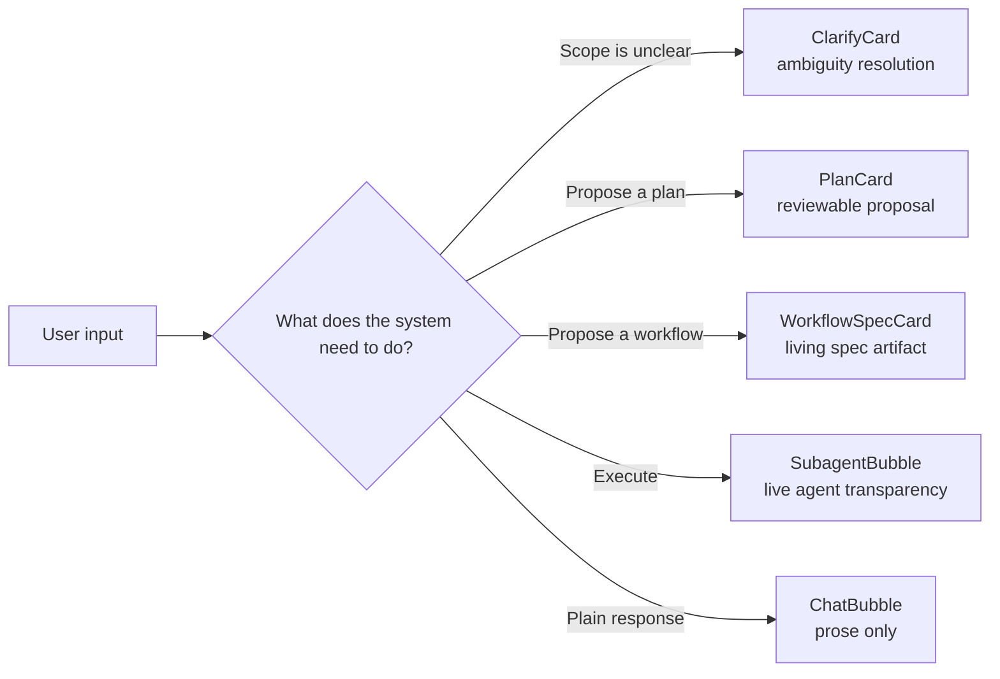
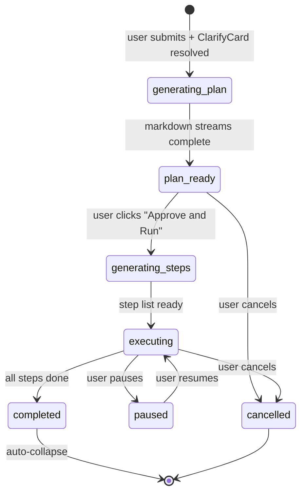

import { SubagentBubblePreview, PlanCardPreview, ClarifyCardPreview } from '@/case-study-previews';

## The one-liner

Messages in the chat aren't just prose. Four of them — ClarifyCard, PlanCard, WorkflowSpecCard, SubagentBubble — are small state machines that sit inline with the conversation. Each one encodes a different conversational move, and each one earns its own render path.

## About the product

Pave is an AI-native app builder. The ChatWindow is the left half of the Builder surface — the only place the user and the AI negotiate intent. This case study is about what I changed when I stopped thinking of chat as a message list and started thinking of it as a series of *moves*.

## How I framed the problem

The easy version of a chat shell is a list of text bubbles. I didn't want that. I wanted the chat to be the *only* surface where the user and the AI negotiate intent — which means the chat had to carry more than text. It had to carry proposals the user can edit, execution traces the user can watch, and decision points the user can approve or rewrite.

The failing pattern I was designing away from: tools where a chat generates output, then all subsequent editing happens in a different pane and the chat goes quiet. The chat becomes a history tab. I wanted the chat to stay where the *work* lives.

## The shape I landed on

Four typed turn types inside the message stream:

**ClarifyCard** appears before any work begins. Copy pattern: *"Before I plan the schema changes, a few things to nail down:"* — not interrogation, collaborative scoping. Presents 1–4 option checkboxes plus a free-text "Something else." The move is: narrow the specification before spending compute on generation.

<ClarifyCardPreview client:visible />

**PlanCard** has eight named states. It's the two-phase proposal: a narrative markdown plan, then a typed step list with agent assignments and estimated durations. It has one approve button called **Approve and Run** — renamed from just "Approve" after design review caught that users didn't realize execution started immediately.

**WorkflowSpecCard** is the living-artifact pattern. It stays in the thread as a reference object, not a transient proposal. Rollback is always a new forward action — a new spec card — never destruction of history.

**SubagentBubble** makes execution legible. Active agents surface one-by-one; completed agents collapse to a label and check. The transparency is borrowed from an existing pattern in coding-agent tools.

<SubagentBubblePreview client:visible />

## PlanCard's lifecycle

The card auto-collapses on completion — it recedes from the thread's attention while still being an audit entry. That collapse is a small thing that matters a lot: a completed plan doesn't need to compete with the next message.

<PlanCardPreview client:visible />

## Elegant bits (what I'm proud of)

- **Parent-padding stripping for rich cards.** A rich card inside an assistant message would otherwise be wrapped in the same bubble padding as prose — which makes the card read like a styled paragraph. A CSS selector that looks for the card inside the message zeroes out the wrapper padding so the card sits flush against the message boundary. It reads as a distinct actionable object, not decoration.
- **Three rem of air between turns.** The messages container and the messages list each contribute 1.5rem of spacing — double-applied so adjacent turns breathe at 3rem total. Different message types vary dramatically in height, and I needed enough breathing room to keep them visually separate. This was deliberate.
- **The ClarifyCard was a later addition.** The original plan mode just generated. After user-testing, it was clear users wanted a beat between "I typed my intent" and "the AI committed to a plan." The ClarifyCard became that beat.
- **Approval copy is one rename that carried weight.** "Approve" → "Approve and Run." Users didn't know execution started on click. The two extra words fix the legibility.
- **Chat owns the composer, the composer owns the banner and queue.** The composer can grow its textarea but never eat the scroll region. The queue and banner stack inside the composer, not outside it — so the composer height varies but the layout stays stable.

## Motion + craft

- **Plan streaming**: word-by-word at 50ms per word. Not chunked. The preview-panel overlay gets the same stream simultaneously, so the chat bubble and the full-screen editor grow in lockstep.
- **Step stagger**: 1500ms initial pause after plan completion, then 600ms per step. A 5-step plan finishes in under 5 seconds. I picked 600ms because it's long enough to read, short enough to not feel sluggish.
- **No bubble entrance.** Individual message rows don't fade in. The streaming word count growing *is* the entrance signal. Adding an opacity fade would compete with the streaming feel.
- **No streaming cursor.** The growing word count is the typing signal. I preferred this to a blinking cursor — cursors make it look like the AI is typing in-place; word-growth makes it look like thought forming.

## Screenshots

## What I gave up

- **No screen-reader live region** on the messages list. Messages arrive silently to assistive tech. Biggest a11y gap.
- **Focus doesn't move to new ClarifyCards.** Keyboard users have to Tab into the options after they appear. Should auto-focus.
- **No virtualization.** Cheap at the seed scale, breaks at 1000 messages. The word-tick streaming would be the first thing to stutter.

## Open threads

- **Context memory at length.** The thread is "the audit log" but there's no design for how the AI's context gracefully degrades at 500+ turns.
- **Failure recovery as a message type.** There's no distinct state for "the run failed, here's what to do." Should exist.
- **Build mode while in Plan mode** — what if the user fires a build command mid-plan? Unresolved.
- **Multi-element-to-chat handoff.** The vision promises "click a node, insert a reference token into the chat input." Undesigned and unimplemented.
