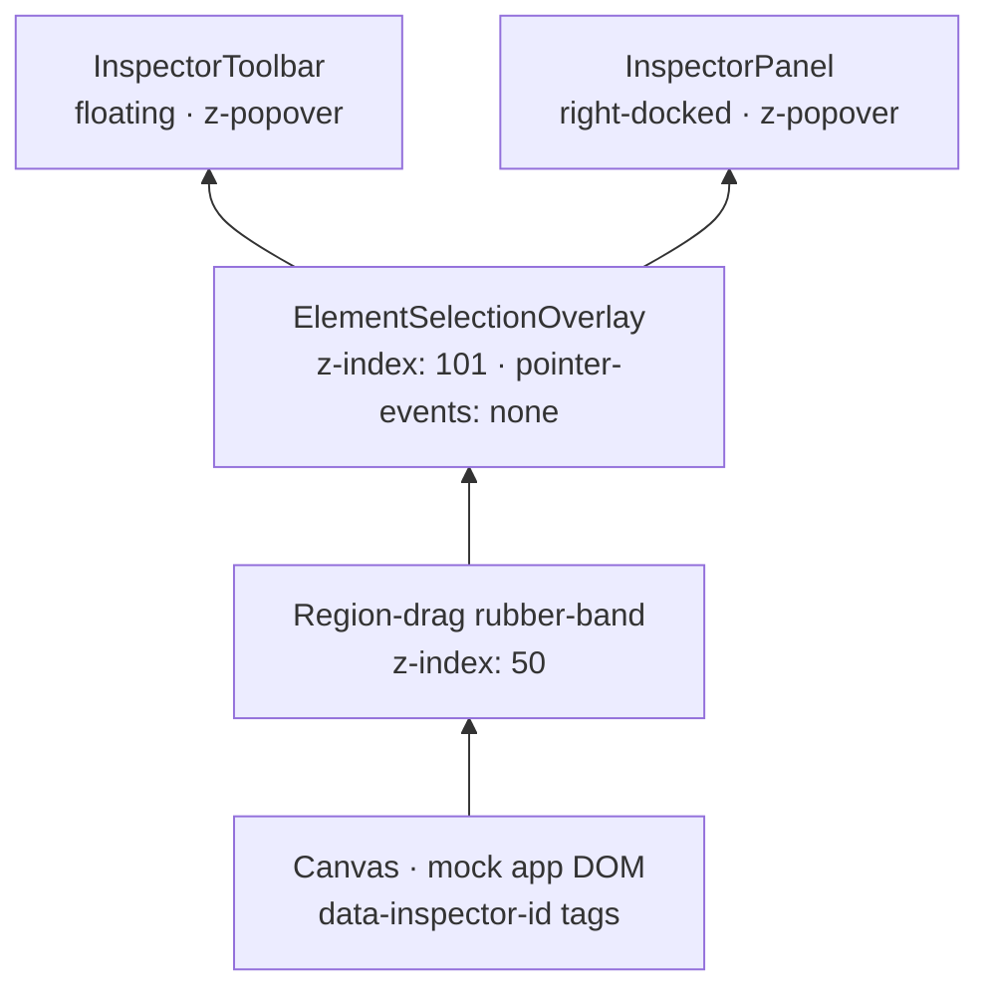
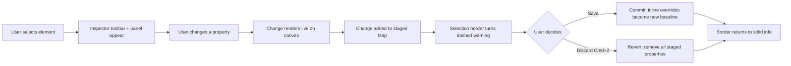

import { SpacingControlsPreview } from '@/case-study-previews';

## The one-liner

The Inspector is the layer that makes AI output editable without re-prompting. You click an element; a toolbar floats over it; changes preview live but don't commit until you save. It's the answer to "I want to tweak this heading, not regenerate the whole page."

## About the product

Pave is an AI-native app builder. The Inspector sits on top of the generated canvas in the Builder surface — it's the surface where deterministic property editing coexists with AI-driven semantic editing. I designed the interaction grammar (four selection states), the spacing editor, and the Design/Prompt toggle that lets both editing modes share the same pending-change layer.

## How I framed the problem

Watching people use AI page-builders, I kept seeing the same move: they'd generate something, see it wasn't quite right, type a new prompt, and the AI would rebuild the page — usually degrading something that *was* right. "Make this heading smaller" would subtly change three other elements.

The way out wasn't a better AI. It was giving the user a local, deterministic path to small changes — one that doesn't route through the AI. The AI stays available for semantic edits ("make this feel more approachable"); direct manipulation handles the numeric ones ("8px less padding").

I also wanted this surface to feel like *working on an app*, not like *operating a design tool*. Those are different mental models. A design tool announces itself — permanent panels, persistent chrome, a mode called "inspector." An app editor whispers: the chrome only appears when you need it.

## The shape I landed on

The inspector stacks four layers over a live canvas:

The key architectural move is `pointer-events: none` on the overlay layer. The overlay paints highlights, borders, and badges, but all clicks **fall through to the canvas below**. So selection feels like clicking the element directly — because you *are* clicking it.

**The visual grammar is the thing I'm most proud of:**

| State | Border | Color |
|---|---|---|
| Hover | dashed | info, 60% |
| Selected (clean) | solid | info, full |
| Selected (dirty — pending changes) | dashed | warning |
| Multi-selected | solid | info + reduced shadow |

Border style encodes commitment — dashed = tentative or pending, solid = committed. Border color encodes state — info = normal, warning = unsaved. Shadow intensity encodes hierarchy — heavier for primary, lighter for secondary in a multi-select.

Four distinct selection states expressed through two axes (style, color) plus one modifier (shadow weight). Once you see the grammar it teaches itself.

## The staged-change model

This is the other thing I'm proud of, and it was a bet against the industry default.

Edits preview live, but they're held in a pending layer. The user explicitly saves or discards. This is the **psychological safety move** — target users are builders, not developers, and for that audience "I accidentally broke the layout" is a support event, not a recoverable nuisance. An immediate-apply model requires users to remember to undo; a staged model asks them to remember to save. Forgetting to save loses a pending edit; forgetting to undo corrupts output. The latter is the more destructive error.

## The spacing editor

The spacing editor is a box-model diagram with ghost inputs at each edge. Drag a label to scrub. Click to type. Live preview applies your values to a real element. Try it.

<SpacingControlsPreview client:visible />

## The Design / Prompt toggle

Inside the toolbar, a sliding pill switches between **Design mode** (deterministic numeric controls) and **Prompt mode** (a small AI channel for semantic edits). Both modes share the element selection and the staged-change layer — so a prompt-generated change goes through the same commit gate as a numeric one.

This toggle is the most deliberate UX decision in the inspector. Some edits are properties ("16px padding"). Some edits are descriptions ("make this card feel lighter"). Forcing the user into one mental model breaks the other. The toggle refuses to subordinate either.

## Elegant bits

- **Canvas-relative rect coordinates.** Every rect is stored with the canvas as the origin — not the viewport. No scroll-offset math on re-render. One read, done.
- **Live-sync on canvas changes.** A ResizeObserver on the canvas plus a passive scroll listener keep overlay rects in lockstep with the canvas. Layout changes anywhere — a collapse, an animation, a resize — and the overlay follows in the same frame.
- **Sibling outlines.** When you hover an element, faint outlines appear on its siblings. You see the grouping without needing to open a layers panel. The pattern emerged from research finding that users use the layers panel primarily to disambiguate what they're about to click.
- **Multi-select stagger.** When you CMD-click a set of elements, their outlines appear with a 30ms stagger — a small "lock-on" effect that signals set identity without delaying the interaction.
- **Multi-select was added later.** The initial inspector was single-select only. Multi-select landed in a later pass, alongside a production-quality review that tightened the token compliance across the whole subsystem.

## Motion + craft

- **150ms enter, 100ms exit, 40ms badge stagger.** 150ms is the sweet spot where interactions read as responsive but the transition communicates. Exits are shorter because exits shouldn't feel like obstacles.
- **Every variant gates on reduced-motion.** When reduced-motion is on, mount is instant, unmount is instant, no scale or y-offset. The presence machinery still runs so the DOM is correct — just no perceptible motion.
- **Dirty selection border pulses with nothing.** I considered a subtle breathing animation on the dirty-state ring. Decided against it — ambient signals shouldn't move. The dashed warning color is loud enough.
- **Toolbar cross-fade on selection change.** Interruptible — a rapid click-through doesn't pile up animation.

## Screenshots

## What I gave up

- **No keyboard selection.** Mouse only. No Tab to focus elements, no Enter to select, no arrow keys to traverse. Real gap.
- **No `aria-selected` exposure.** Screen readers can't tell which element is selected. The toolbar carries toolbar role and auto-focus on appear, which is something — but the canvas itself is pointer-only.
- **Spacing editor is missing arrow-key increment.** Every pro tool has it. Also a WCAG gap for motor-disability users. Highest-ROI improvement available; not shipped.
- **No canvas zone overlay on spacing edits.** When you change padding, Figma highlights the changed zone in amber. Mine reflows but gives no spatial signal. Known gap.
- **Tag badge contrast in dark mode** sits at ~3.2:1 — below WCAG AA 4.5:1. Tracked.

## Open threads

- **Cross-origin iframe.** When the preview becomes a real iframe, the browser APIs the inspector uses will throw. Needs a postMessage bridge before production.
- **Persistence across generations.** If the user saves a staged change and then asks the AI to regenerate, what happens to the saved edit? Current prototype mutates the DOM directly — not durable. Production needs a real diff-and-merge strategy.
- **Per-property undo.** Discards all pending changes today. Users might want step-by-step undo. Competitive research flags this as a market-wide gap.
- **Nested element selection policy.** What happens when you click an element inside a container that's also inspectable? The granularity rule isn't specified.
- **Inspector Prompt mode** — inline local change or new chat turn? Architectural question that determines where conversation state lives.
