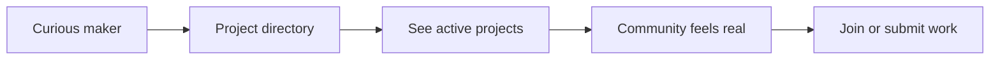

## Summary

Bolt.fun was listed in my old portfolio as product work connected to the makers project directory. The public product framed itself around helping people learn, build, and share Bitcoin and Lightning applications.

The case-study value here is the product framing: a technical ecosystem needed a place where makers could see activity, understand momentum, and recognize that building on Lightning was something people were already doing together.

## Problem

Early builder communities often have the same failure mode: the work exists, but it is scattered across chat, demos, repositories, and social posts. That makes the ecosystem feel smaller than it is.

The project surface had to make ongoing work visible enough that a visitor could answer three questions quickly:

- What are people building?
- Which projects are active?
- How do I find a path into the community?

## Approach

The strongest product move was not to over-explain Bitcoin or Lightning. It was to organize the builder proof.

The old project link pointed directly to the makers project directory, so the case study is centered on discoverability and momentum: project cards, categories, creator context, status, and visible examples of what the community was producing.

## Outcome

The work sits in the portfolio as an archived community-product case study: a product surface designed to make a niche builder ecosystem easier to enter and easier to trust.

## What I would sharpen now

- Separate beginner onboarding from expert project browsing.
- Add clearer project health signals so abandoned work does not read as current work.
- Show the next action for each project: follow, contribute, try, or contact.
