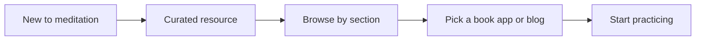

## Summary

The Improved Mind was a personal editorial project about mindfulness and mental wellness. It started in 2019 and became a resource website in early 2020.

The design challenge was to make a calm, useful entry point for people asking how to begin with meditation, without turning the page into either a clinical directory or a decorative mood board.

## Problem

People around me were interested in meditation, but the first step felt vague. Books, apps, teachers, essays, and blogs all helped, but they were scattered.

The product needed to gather those resources into a page that felt inviting and slow enough to match the subject.

## Visual language

The visual system drew from karesansui gardens, river stones, earth colors, and Zen culture. Pebble-like forms became the main motif because they carried both natural texture and a metaphor for how repeated experience shapes the mind over time.

The color palette stayed close to natural references: earth, sand, grass, and sky. The goal was not minimalism for its own sake, but a visual tone that made the content feel easier to approach.

## Interaction design

The header used elliptical elements and parallax motion to suggest the constant flow of attention. The content sections gave books, blogs, and apps a simple browsing pattern, with cover art as the main visual hook.

On desktop, hover states revealed titles. On mobile, titles stayed visible by default so the interaction did not depend on unavailable hover behavior.

## Expanding the system

The project later extended into social posts built around short quotes. The same pebble shapes and natural palette carried across the Instagram format, creating continuity between the website and the content feed.

## Outcome

The Improved Mind became a case study in editorial product design: take a personal learning journey, structure it into a useful public resource, and give it a visual system that matches the emotional tone of the subject.

## What I would sharpen now

- Make the resource taxonomy more explicit.
- Add source notes and personal annotations for why each item matters.
- Reduce motion automatically for users who prefer less animation.
