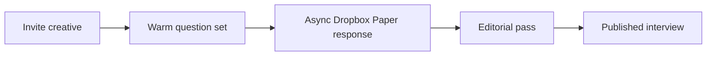

## Summary

We-are Design began as a small CSS exercise and grew into an interview platform for designers and creatives. The intent was to give more visibility to people from communities that were not always part of the mainstream design conversation, including the Bulgarian creative community I was close to.

## Problem

The core problem was not only publishing interviews. It was creating a format that made people feel comfortable sharing personal and professional experience.

For a small independent project, that meant the interview process had to carry as much care as the website.

## Question design

The questions became the foundation of the product. I wanted the interviews to feel both insightful and personal, so the prompts mixed career questions with everyday-life questions.

Instead of only asking for achievements, the interview asked about the beginning of the day, the origin of a passion, and the personal path behind the work.

## Interview flow

The first Dropbox Paper questionnaire was too dry. It looked like a form, not an invitation.

I reworked the document with more structure, warmer placeholder copy, and a closing note that made the interviewee feel appreciated rather than processed.

## Visual system

The website and social posts used a mix of clean Swiss-influenced typography, strong grid behavior, and intentionally raw visual energy. The promotional posts focused on the essentials: name, image, and role.

## Outcome

We-are became a case study about designing the full editorial system around care: the public site, the social assets, the interview format, and the private workflow that helped people contribute without pressure.

## What I would sharpen now

- Build a stronger publishing cadence before expanding formats.
- Create interview templates for different creative disciplines.
- Add clearer archive browsing by country, discipline, and theme.
