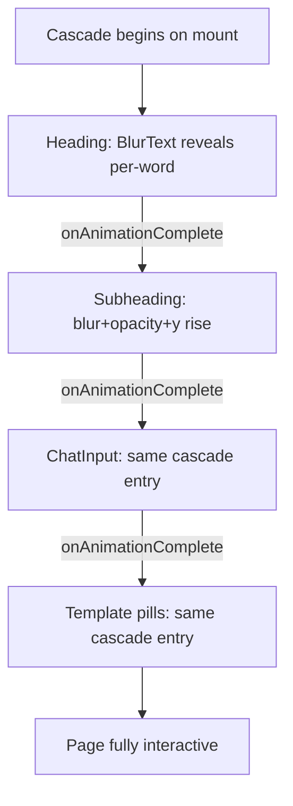

import { BackgroundGradientPreview, BlurTextPreview } from '@/case-study-previews';

## The one-liner

The first surface a signed-in user sees is not a dashboard. It's a prompt, a gradient, and four pills — the product asks them to say what they want before offering them anywhere to go.

## About the product

Pave is an AI-native app builder for the business-automation space — the bet that conversation and the canvas should be one object, not two modes. I led design on the prototype: information architecture, motion system, component library, and the living design-intent artifact engineers build production against. The work spans about twenty pages and fifteen composites; this is one of them.

## How I framed the problem

The authenticated landing for an AI app builder is almost always a project list. I rejected that on principle. A project list is a surface that says *"continue what you were doing"* — but this product is for people with an idea they haven't started yet. If I put projects first, I'd be asking the user to be a manager of past work. I wanted to ask them to be the person with an idea.

The failure mode I kept designing against was the **blank-input freeze**. Competitors either dump the user into a wizard or into a canvas — both are legibility problems pretending to be empowerment. I wanted the opposite: one affordance, no menus, no decisions.

## The shape I landed on

Four content tiers arrive in a strict cascade — heading, subheading, composer, pills. Each tier unlocks the next. You can't look at two things at once because only one is on screen at a time.

Behind the cascade, the gradient is doing something I'm proud of: **it reacts semantically to what the user types.** Type "crm" and the orbs shift amber. Type "dashboard" and they shift blue. Type "booking" and they go violet. No affordance tells the visitor this is happening — it's a reward you only notice if you're looking. The product starts reacting to your intent before you've submitted anything.

<BackgroundGradientPreview client:only="react" />

## Elegant bits (what I'm proud of)

- **The composer is the real composer.** The ChatInput on Home is literally the same component used inside the AI chat. No mock, no demo shim. The first message a user types on Home is architecturally identical to the first message they'll type to the AI post-submit. One component, three contexts. No forking.
- **The cascade gates itself.** I didn't use staggered delays — I chained each tier's entry to the previous tier's animation-complete event. A slow device doesn't show pills overlapping the heading. The sequence always completes before the next one starts, regardless of frame rate.
- **Orbs move outside React.** The semantic palette lerp mutates CSS custom properties directly on the orb DOM nodes via requestAnimationFrame. Zero re-renders for 60fps motion. This is a design decision living in the performance budget — if palette interpolation routed through React state, the whole page would reconcile 60× per second and the gradient would stutter.
- **"pave." is not text.** The wordmark word in the heading swaps to inline SVG paths with 80ms letter-by-letter stagger. Brand signature without depending on a font load.

<BlurTextPreview client:visible />

- **No exit animation.** When the user navigates away, nothing unwinds. I chose this deliberately — the page should feel like a threshold, not a room you tidy before leaving.

## Motion + craft

- Cascade entry: `blur(10px) → blur(0)`, `y: -20 → 0`, `opacity: 0 → 1`. 350ms, easeOut, 80ms delay between tiers.
- Orb reveal (first mount): scale `0.3 → 1`, 3s, a slow confident arrival.
- Orb parallax: 10% of scrollY. Slight, not showy.
- Semantic palette interpolation: 400ms debounce after keystroke, then 1800ms ease across five color channels.
- Pill hover: short and snappy, tokenized.
- Typewriter placeholder cycles 15 example prompts when the input is empty.
- `prefers-reduced-motion: reduce` collapses everything to instant — the cascade booleans flip true on mount, the typewriter swaps to static text, transitions are killed.

## Screenshots

## What I gave up

- **The prompt handoff is stubbed.** Submitting currently clears the input instead of navigating into the builder with the prompt pre-loaded. The mechanic is designed; the wire isn't connected yet.
- **No returning-user state.** If you have 40 projects in flight, Home doesn't know or care. I decided "Home is always for new intent" but I never proved that. A "recent" strip might be the right compromise.
- **Six simultaneous animation layers is a lot.** The reduced-motion fallback is thorough but I haven't user-tested with people who are sensitive to motion. Design debt I'm tracking.

## Open threads

- **Schema-aware pills.** The four template pills are static. The version of this I want shows suggestions generated from the user's actual data model — "Build a dashboard for the Orders table you already have." That needs a schema API contract that doesn't exist yet.
- **The prompt handoff mechanism.** `sessionStorage`? URL query? A store slice? The decision depends on deep-link requirements nobody's written down.
- **Home as a returning-visitor surface.** What this page does on visit #47 is unresolved.
