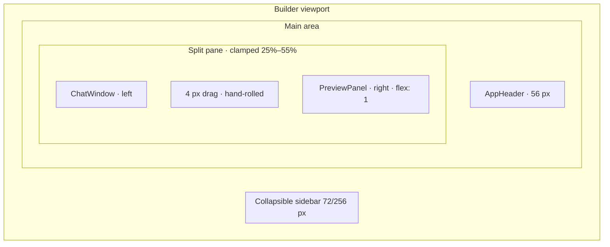
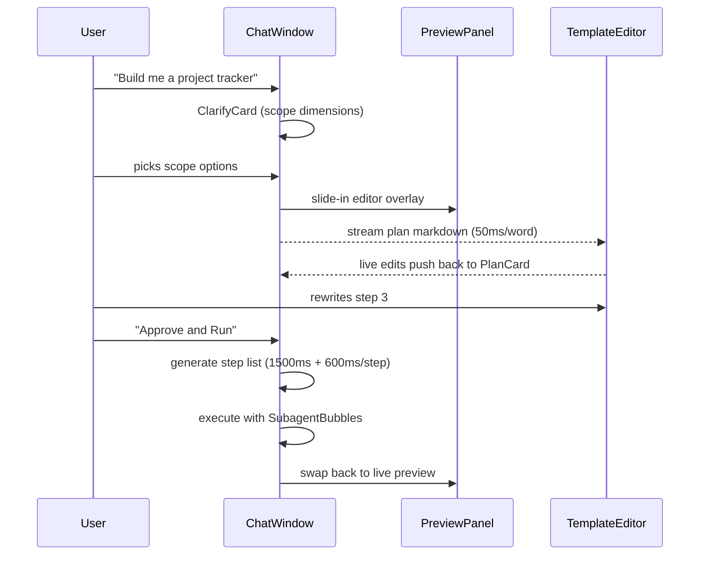

import { PlanCardPreview, ClarifyCardPreview } from '@/case-study-previews';

## The one-liner

Builder is a split pane. The chat lives on the left, the preview lives on the right, and neither side is ever allowed to disappear.

## About the product

Pave is an AI-native app builder — the bet that conversation and the canvas should be one object, not two modes. Builder is the flagship surface where that bet plays out: an AI chat coupled to a live preview, with overlay modes for plan review and workflow diagramming. I led the design of the page, its motion system, and the inspector that sits on top of it.

## How I framed the problem

Every AI builder I evaluated uses the same pattern: conversation as an **on-ramp**, visual tool as the **destination**. You describe a workflow in natural language, the AI produces a starter flowchart, and then the AI withdraws and you're alone with the canvas. Completion rates fall off a cliff the moment the AI disengages.

I wanted conversation and canvas to be two views of the same object — not two modes to toggle between. If the AI is going to be a collaborator instead of a ramp, it has to be present while the user is editing, not just while the user is generating.

That commitment shaped every layout decision on this page.

## The shape I landed on

The chat panel starts at 35% of available width and is clamped between 25% and 55%. That 55% ceiling is the load-bearing design decision — **the chat can never outgrow the canvas.** Even a user who drags the divider as far right as it goes cannot hide the preview. The canvas stays the attention anchor.

When the AI proposes a plan, the right pane swaps. The default preview slides out, and a full-height editable markdown surface slides in from the same direction. The user can **rewrite the AI's plan** before approving it. Execution is gated on approval — and approval is one button, because I wanted attention to be forced.

When the user selects an element in the preview, a floating toolbar anchors above (or below, flipping on clipping). Design mode gives deterministic property controls. Prompt mode opens a small AI channel for semantic edits the user can't easily specify as properties. Both modes share the same staged-change layer: changes render live but aren't committed until the user presses Save.

## Elegant bits (what I'm proud of)

- **The 25–55% clamp is a structural argument.** Almost nobody sees it as a design choice — it looks like a physical constraint of the page. But it's the entire thesis written as a geometry: neither surface is allowed to win.
- **Plan review swaps the preview, doesn't overlay it.** Only one surface lives in the right pane at a time. The slide direction establishes a spatial metaphor: plan review is *deeper into* the preview region, not parallel to it. Exit reverses the motion — coherent push/pull.
- **The divider is hand-rolled.** I considered a library. It would've saved time, but it comes with opinionated DOM and style overrides that felt library-shaped. A custom divider with a hover pip and a drag-active accent color was the right amount of craft for the moment.
- **Background contrast without borders.** Chat panel sits one step lighter than preview. One step of lightness difference. Depth without chrome.
- **The approve button got renamed.** Design review caught that "Approve" didn't communicate execution starts immediately. Renamed to "Approve and Run" after user-test feedback. Small copy fix; big behavior clarification.

## The plan-then-review loop

This is the pattern I'm most proud of on this page. It's a direct answer to the generation cliff.

Two approval gates, not one. First the narrative plan; then the step list. At each gate the user can redirect without re-prompting the whole thing. Every edit the user makes to the markdown plan in the editor pushes back to the chat card in real time — so the conversation surface and the review surface are never out of sync.

<ClarifyCardPreview client:visible />

<PlanCardPreview client:visible />

## Motion + craft

- Overlay swap between preview and plan review: 250ms, decelerate easing. Exit reverses — same motion, mirrored.
- Sidebar offset on expand: 200ms, same easing family.
- Inspector toolbar cross-fade when the selected element changes: interruptible, rapid selection doesn't pile up motion.
- Multi-select prompt: debounced 800ms so rapid CMD+clicks don't flicker the UI.
- Every reduced-motion gate I could add is added. Motion is sugar, not structure.

## Screenshots

## What I gave up

- **Sub-state isn't URL-persistent.** Plan review mode, workflow review mode, version panel visibility, divider position — none of these survive a page reload, and you can't share a URL to "my plan mid-review." Prototype tradeoff.
- **No keyboard resize.** The divider only responds to mouse. Keyboard users can't reshape the page. Known gap.
- **Multi-select only opens Prompt mode.** I haven't designed bulk property editing — e.g., "make all these cards bigger." No prior art in AI builders to lean on.

## Open threads

- **Schema access.** Natural-language conditions depend on the AI reading real data. Until the API is defined, the headline differentiator stays hypothetical.
- **Generation interruptibility.** "Stop — I don't need that step" mid-build requires a streaming architecture with checkpoints. Engineering decision blocks the UX.
- **Prompt mode in the toolbar.** Submitting a prompt currently logs to console. The big open question: does a prompt from the toolbar create a new chat turn, or does it apply locally? The answer decides whether chat owns all conversation state.
