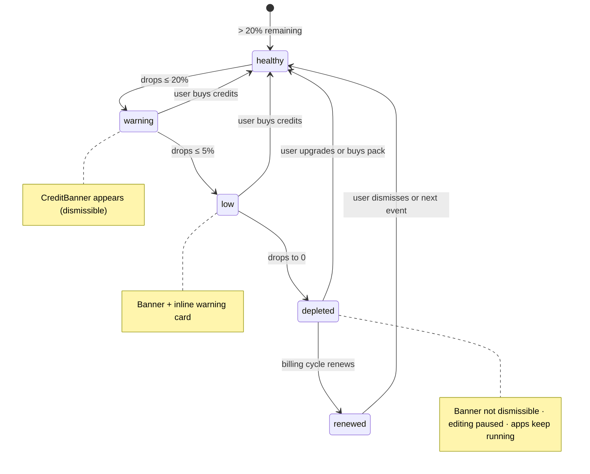
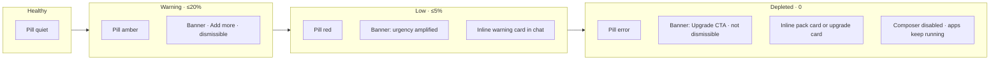

import { CreditPillPreview, CreditBannerPreview } from '@/case-study-previews';

## The one-liner

The product sells generation, not seats. So the UI treats credits as a first-class surface — a persistent pill in the header, a color-coded banner above the composer, a pricing page that opens onto a 365-day usage heatmap. Every transparency choice is aimed at a single outcome: users should know where their spend goes, because they're going to spend a lot.

## About the product

Pave is an AI-native app builder. Billing is the system-wide layer that tracks credit usage — the product's pricing unit — and communicates it across every surface. I designed the state machine, the three persistent surfaces (pill, banner, popover), the pricing and checkout pages, and the copy that turns "you're out of credits" into "here's what happens next."

## How I framed the problem

AI product pricing doesn't fit SaaS seat-based pricing. The cost is per-generation, not per-user. The trial experiment — access scoped in 2-hour build-time sessions, capped at $10/day — tells you how the team thinks: in cost-of-output, not in license count.

But credits have a known trust problem. Users leave credit-priced products when they can't see where their credits go. Credit pricing without transparency becomes anxiety. Credit pricing *with* transparency becomes usage literacy.

So the entire billing surface is designed around that second outcome. Make the meter visible. Make the burn rate legible. Make the moment of depletion feel like help, not a paywall.

## The evolution

Billing iterated through five visible waves in the project:

1. The state machine and its three PLG cards land together (warning, pack, upgrade)
2. Credit pack tiles and the inline `CreditPackCard` arrive
3. Checkout page and a big popover redesign — the information architecture of the popover was reworked from scratch
4. Five-option radio credit packs with a $20 increment pricing ladder
5. `CreditUpgradeCard` tier-upsell card added, Solo pricing finalized

Each wave was iteration — not new features, same features re-shaped. The popover alone went through at least three distinct passes.

## The shape I landed on

The whole system reads from one source of truth — the current credit state — and branches every surface on that state. The pill changes color. The banner appears. The composer disables at depleted. Each state has a state-specific CTA (Add more vs. Upgrade) and distinct copy.

Two sets of surfaces:

**Persistent chrome** — always on:
- The credit pill in the header: ambient, color-coded, quiet until it matters. Clicking opens a popover with animated balance, usage bar, trend indicator, renewal date, and a collapsible credit-sources accordion.
- The credit banner above the composer: state-driven nudge. Dismissible except at depleted.

<CreditPillPreview client:visible />

<CreditBannerPreview client:visible />

**Dedicated surfaces** — opened explicitly:
- Pricing page with Plans + Usage tabs. The Usage tab is the other half of the transparency bet — a 365-day heatmap plus daily burn rate plus detailed line items.
- Checkout — two-column, expandable plan cards left, payment form right, SSL trust indicator before the submit button.
- Checkout modal — the same payment form without the plan selector, opened in-flow from pricing plan CTAs.

## Elegant bits

- **Dismissal that re-prompts on escalation.** If a user dismisses a warning banner at 20%, and their balance drops to 5%, the banner comes back. Dismissal tracks the severity it was dismissed at; the comparison is severity-based. The user can mute the current concern but can't mute future escalations.
- **Copy that resolves anxiety before asking anything.** The depleted banner leads with "Building is paused. Apps keep running." Users who see the depleted state panic about production. The copy answers that panic in the first line, then makes the ask.
- **The pill is quiet.** Healthy state: secondary text color, transparent background. No competing attention. Only at depleted does it adopt a filled error background. The pill respects the rest of the UI — which means you actually look at it when it changes.
- **The usage heatmap is 365 days.** Not 30. Not 7. The horizon matches calendar intuition — a year looks like a year. You can see a spike from two months ago and understand what you were working on.
- **Renewal countdown updates every minute from a memoized date.** The countdown ticks; the date doesn't drift. Small detail, avoids the common bug of re-computing the anchor on every render.
- **No fake urgency.** The renewal countdown is never dressed as an offer-expiry timer. This is called out explicitly in design review as an anti-pattern to police.
- **Two checkout surfaces, same form.** Modal for in-flow upgrades from the pricing page, page for discovery or deep-link buyers.

## The three moves per state

## Motion + craft

- **Banner**: height 0 → auto plus opacity, 150ms, keyed on the credit state. Dismissal reverses the motion.
- **Pill animated balance**: spring inside the popover — the number rolls to its new value rather than snapping. The pill label itself doesn't animate (would be noisy in the header).
- **Checkout entrance**: staggered blur-in across nine form fields, short step. Reduced-motion collapses to instant.
- **Checkout modal overlay**: enters from 16px, exits to 8px. Asymmetric — the modal settles in and leaves quickly.
- Reduced-motion gates throughout. The credit balance spring subscription is skipped entirely when reduced-motion is on.

## Screenshots

## What I gave up

- **Checkout modal has no focus trap.** Tab cycles into the obscured background. Known gap.
- **No error handling.** No declined-card copy, no network failure state, no duplicate-purchase guard. Success redirect doesn't wait for webhook confirmation.
- **Two plan-tier configurations drift** — one local, one shared. Different shapes. Should converge.
- **No annual/monthly toggle on the pricing page.** The −20% yearly savings signal only appears deep in the checkout funnel.
- **The credit-pack "Buy" button on pricing is unwired.** Plan CTAs open the checkout modal; pack CTAs render but have no handler.
- **No FAQ on pricing.** Trust-building content is absent.

## Open threads

- **Trial ramp curve.** The trial experiment scoped access by build-time, but the trial → paid transition isn't designed as a distinct surface.
- **Refund policy.** Absent from all reviewed docs.
- **Mid-cycle downgrade.** No proration policy.
- **Enterprise checkout.** Sales-led today; the contact flow isn't designed.
- **Auto-renewal mid-build.** When a depleted user's cycle rolls over mid-chat, the banner should transition to renewed gracefully. Wiring exists; polish is untested.
