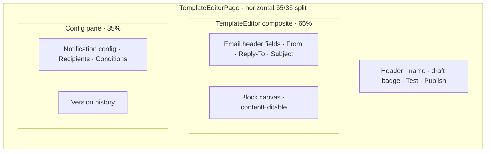
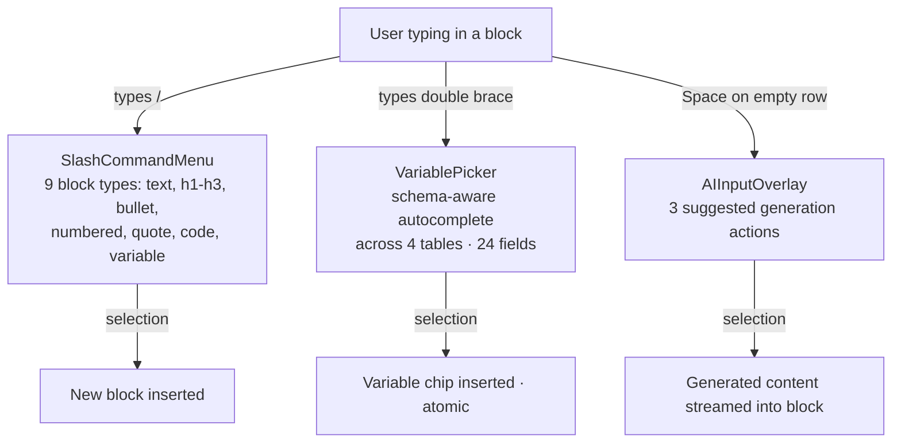
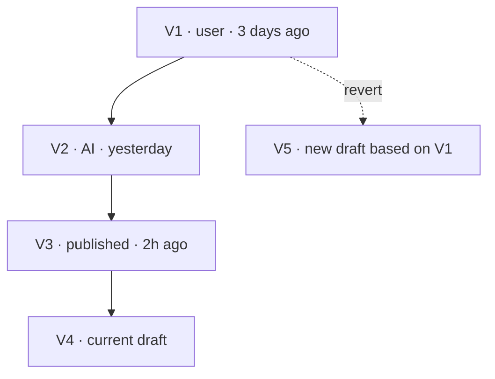

import { TemplateEditorPreview } from '@/case-study-previews';

## The one-liner

A keyboard-driven block editor for email templates. Three composer keys (`/`, `{{`, Space) do three different things. Variable chips are atomic. Version history is a timeline with source attribution. And — the non-obvious part — the same editor also powers plan-document editing in Builder, because emails and plans are both the same underlying shape: editable markdown with typed variables.

## About the product

Pave is an AI-native app builder. The template editor powers two surfaces: the dedicated email template page, and the plan-review overlay inside Builder where users can rewrite AI-generated plans. I designed the block model, the keyboard composers, the variable-chip grammar, and the version panel.

## How I framed the problem

Template editors in legacy tools fail on three points:

1. **HTML exposure.** Users type merge tags as strings. A typo sends to a broken template silently.
2. **No schema awareness.** Users must remember which tables have which fields.
3. **No meaningful preview.** "Preview" renders literal merge tags instead of sample-resolved values.

The template author for this product isn't a marketer. They're an ops lead, a business analyst, or an application owner configuring a notification that fires on a record event. They think in **field names**, not merge-tag syntax. The editor had to resolve field identity at authoring time — not at send time.

I also wanted the editor to be a composite, not a page-specific feature. The same editor ends up inside the Builder page for plan-document review. That reuse isn't a coincidence — it's the insight that emails and AI-generated plans are both the same shape: structured markdown with schema-aware variables, version history, and draft/publish semantics.

## The shape I landed on

**Email header fields live in the *page*, not the editor composite.** The composite doesn't know about From / Reply-To / Subject. When the editor is reused in Builder for plans, those fields don't appear. Clean boundary.

**The editor is a block document model** — hand-rolled. Every block has typed inlines (plain text or variable chip). Serializes to a Markdown-plus-`{{Label}}` dialect. Human-readable, version-controllable, trivially migratable.

## The three keyboard composers

Three entry keys, three different tools, same physics. All three menus portal outside the parent containers so they never get clipped. All three use a capturing keyboard listener for arrow-nav, Enter, Escape, and Tab-autocomplete.

<TemplateEditorPreview client:only="react" />

## Variable chips as atomic units

This is the detail I keep pointing at. A `{{firstName}}` chip isn't text with special formatting. It's a non-editable span that the user can select, copy, and delete as a single unit. Backspace one position before the chip deletes the chip whole, not one character of the label.

The chip renders with a distinct pill visual — accent-tinted background, accent text, smaller font size, rounded corners. Hover shifts to a subtler color-mix tint. The chip is visually obviously not prose.

The chip knows which table and field it points to. (In memory — the serializer drops that identity on round-trip, which is an open production debt.)

## Version history as authoring tool

Timeline dots encode source: accent dot = current draft, success-green = published, info-blue = previewing. Each version carries attribution (user / AI / publish).

**Revert is non-destructive.** Reverting V1 creates a new draft V5 based on V1's content. History is never rewritten.

## Elegant bits

- **Two surfaces for version history, one mental model.** A compact popover in the template editor header; a slide-in side panel with timeline dots and attribution icons — reused in Builder for plan-document versioning.
- **One editor composite, two contexts.** Email templates on the dedicated page; plan markdown inside Builder. The composite doesn't know which context it's in. Live cross-sync in Builder pushes editor changes back to the chat card in real time.
- **`contentEditable` managed imperatively, not via React children.** A layout effect syncs the DOM to state without giving React ownership of the children. This avoids the reconciliation conflicts that break most naive contentEditable integrations. The composite handles the dirty work so callers don't have to.
- **Markdown shortcuts are separate from slash commands.** Typing `# ` at the start of a line promotes it to heading 1. Typing `/` opens the menu. Two input affordances, different modes, no collision.
- **Slash menu closes on Tab-autocomplete.** Not Enter-only. The Tab affordance is borrowed from code editors; it matches users' muscle memory.
- **AI input on Space in empty row.** A third trigger that doesn't need a menu — just a hint that suggests three AI actions when you hit Spacebar on an otherwise empty line.
- **Publish vs. Test buttons** on the header. Publish commits and sends for real; Test fires a preview to the signed-in user. Clear distinction, no dark pattern.

## Motion + craft

- **Block reorder**: drag-to-reorder with layout animations. Drag handle on hover.
- **Slash / variable menus**: portal-rendered, fade-in, capturing keyboard listener for navigation.
- **Variable chip hover**: a subtle color-mix tint shift.
- **Version revert**: fires immediately. Flow spec calls for a confirm dialog; not implemented yet. Debt.

## Screenshots

## What I gave up

- **Deserialization loses field identity.** The serializer writes `{{Label}}` but the deserializer can't recover which table/field that label pointed to. Round-trip breaks schema-awareness. Most critical production-port gap.
- **No autosave.** Close the tab, lose the draft.
- **No undo/redo stack.** Only browser-native undo per contentEditable block. A proper history stack is future work.
- **No inline formatting toolbar.** No keyboard shortcuts for bold/italic. Block changes come from slash commands only. Power users might miss this.
- **No HTML preview pane.** The preview renders raw Markdown, not email-client-rendered output. Email clients vary wildly; a real preview needs a third-party service.
- **No virtualization.** Every block renders. Unusable at 10k blocks.
- **Accessibility.** Drag handles aren't focusable. Variable chips don't expose label text to the accessibility tree. No live region for mutations.

## Open threads

- **Merge variables vs. evaluated expressions.** Date formatting, computed fields, conditional content — the variable syntax today is field-identity only.
- **Conditional content blocks.** Not in the slash command inventory.
- **Multi-lingual template variants.** No locale branching designed.
- **Orphaned variable behavior.** When a schema field is deleted after publish, what happens to templates still referencing it? Undocumented.
- **True email-client fidelity.** Would need a third-party service. Current preview is a browser render.
- **Send test email actually sends.** Currently stubs to console.
