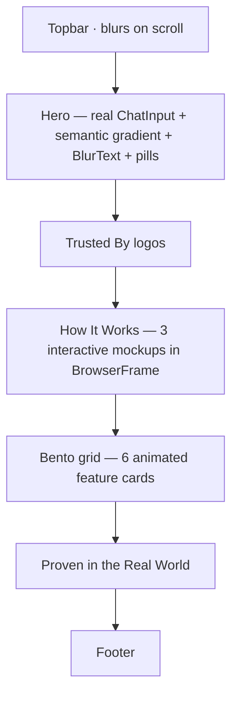
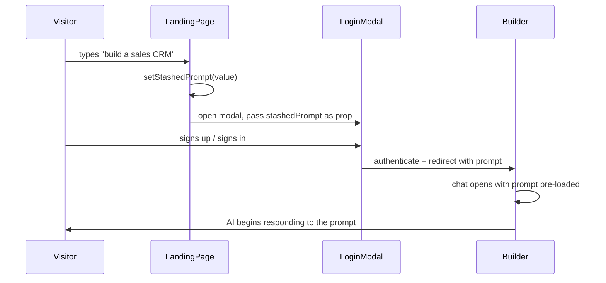

import { BackgroundGradientPreview, BlurTextPreview } from '@/case-study-previews';

## The one-liner

The marketing page and the sign-in page are the same page. A visitor arrives, types a prompt, watches the gradient react to their words, hits send — and authentication becomes the act of *retrieving* their prompt, not unlocking the door.

## About the product

Pave is an AI-native app builder. The landing page is the first thing a public visitor sees. I led the design across three iterations — the initial gradient system, a rewrite with the bento grid and interactive mockups, then a content-feedback pass on the CTAs — and shaped the stashed-prompt mechanic that turns the auth boundary from a paywall into a handoff.

## How I framed the problem

People landing on an AI-builder marketing page already have a belief about AI builders. That belief — formed by Zapier, Make, v0, Durable, Framer — is roughly *"useful to start, useless after that."* Copy doesn't refute this. Only behavior does.

I also wanted to refuse the industry default: "Sign up to try." That flow loses visitors at the moment intent is highest. By the time someone has typed an email address and clicked a verification link, the reason they came has evaporated.

So I inverted the geometry. The landing page's job isn't to sell — it's to let the visitor *experience* the product. Auth is a stash-and-retrieve mechanism, not a gate.

## The shape I landed on

## The stashed-prompt mechanic

This is the clever bit. The hero input is the *real* composer — the same component used inside the authenticated builder chat. When a visitor types and hits send:

The prompt survives the auth handoff. Authentication becomes *prompt retrieval*, not a paywall. The user's first AI interaction in the app happens to the words they typed on marketing — a continuity that's hard to feel but impossible to forget once you've felt it.

<BackgroundGradientPreview client:only="react" />

## Elegant bits

- **Visual continuity across the auth boundary.** The cascade animation on the landing page is the same config as the authenticated Home page. Pre-auth and post-auth, the visitor is looking at literally the same components. This is the strongest trust signal the design produces: what you see before signing up is what you get.
- **The mockups are interactive.** "How It Works" isn't three screenshots. It's three live dioramas inside browser-frame chrome. Each has its own composer; each has its own CTA that triggers the LoginModal. Every section is a conversion surface, but none of them feel like sales.
- **Semantic gradient interpolation on the hero.** Same magic as Home — type "crm" and the orbs shift amber — but here it's also a marketing proof-point: the product is *already* reacting to the visitor's words.
- **One composer component, three contexts.** Marketing, Home, and Builder all import the same composer. The mockups, however, each built their own mini-composer — because they need to *demo* the flow without actually submitting it. Good boundary.
- **Topbar blurs on scroll.** Subtle, but it tells the visitor "you moved."

<BlurTextPreview client:visible />

## Motion + craft

- Hero cascade: same timing as the authenticated Home (350ms per tier, 80ms delay).
- Gradient reveal on first mount: 3s scale-in, a slow confident arrival.
- Semantic palette: 400ms debounce, 1800ms rAF lerp across five color channels — outside React.
- Orb parallax: 10% of scroll, smooth, quiet.
- Bento cards: scroll-reveal triggers SVG-animated illustrations on hover.
- Mockups: timed animations inside the builder-mockup play when visible.
- Reduced motion collapses cascade instantly, kills gradient reveal, disables mockup animations.

## Screenshots

## What I gave up

- **The Bottom CTA section didn't ship.** A standalone "Start building" band between Proven and Footer got designed and never built. One of the flow-diagram journeys dead-ends.
- **The stash consumption isn't wired.** The modal receives the prompt as a prop but currently doesn't act on it. The re-hydration into Builder is a callback contract waiting on the parent.
- **Trusted By has empty placeholder logos.** Content task.
- **No testimonials content** in "Proven." Just illustration and copy.
- **LoginModal has no focus trap.** Tab cycles out of the modal into the obscured background. Known gap.
- **No code splitting.** The landing page plus its motion library plus the gradient engine ship to every unauthenticated visitor.

## Open threads

- **Actual prompt-handoff mechanism.** sessionStorage, URL query, or a store slice — the decision depends on deep-link requirements nobody's written down.
- **Mobile hero.** The flow diagram describes desktop journeys; mobile may need a different hero shape.
- **Semantic gradient discoverability.** The palette shifts when you type, but no affordance tells you to try it. Whether anyone notices is untested.
- **No conversion data.** The "prompt-first beats sign-up-first" bet is uninstrumented.
