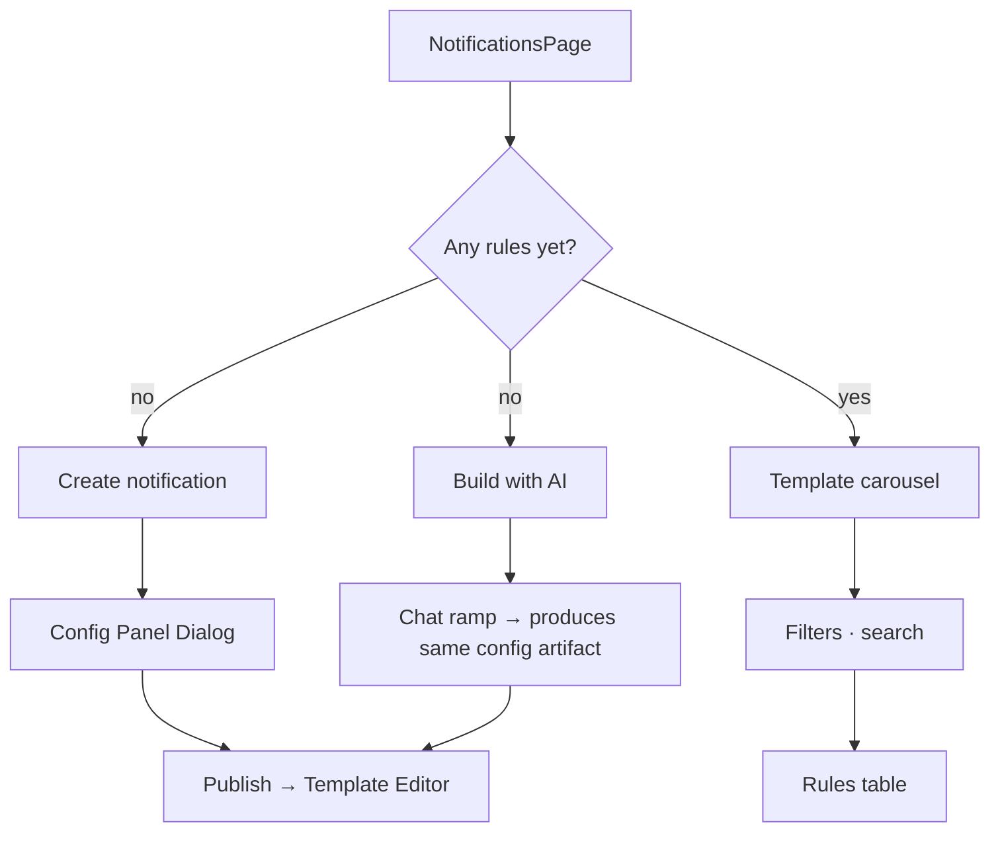
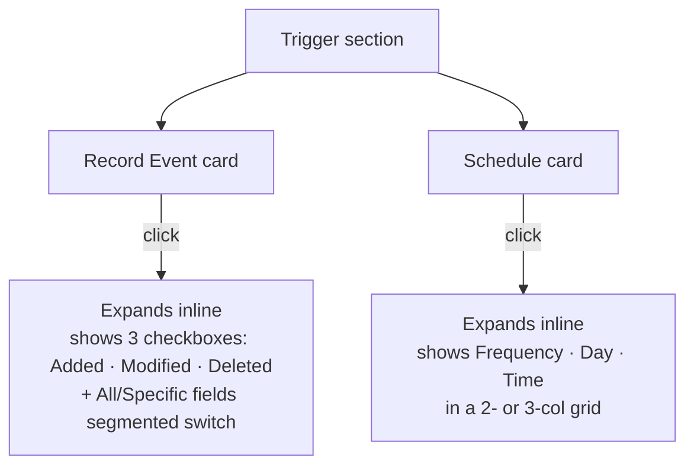
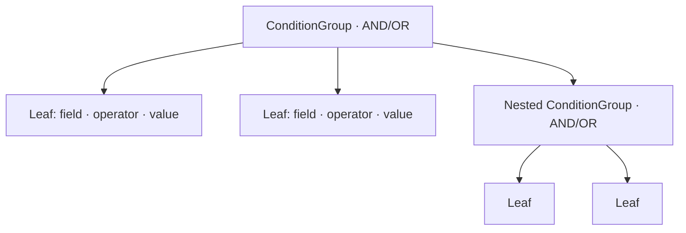

## The one-liner

A structured rule builder: pick a table, pick a trigger, set conditions on a recursive AND/OR tree, pick recipients, then hand off to the Template Editor for the email copy. Deterministic creation on one hand, a *Build with AI* ramp on the other — same artifact, two authoring postures.

## About the product

Pave is an AI-native app builder. Notifications is the surface where users set up rules that fire on record events. I designed the page IA, the config panel, the trigger-card pattern that lives in place of a dropdown chain, and the recursive condition tree.

## How I framed the problem

Notification builders in legacy tools fail in three structural ways: generation cliff, opaque condition logic, no schema awareness. Add a fourth failure local to this surface — **visually disconnected trigger sub-options**. In most tools, picking "Record event" and then choosing which event (Added / Modified / Deleted) is a chain of three dropdowns that loses the user between steps.

I wanted the trigger choice and its sub-options to live in the same visual container — so you don't lose context when you commit to a trigger type.

I also wanted two entry ramps. A user who knows exactly what rule they want should have a deterministic path. A user who doesn't should be able to say *"notify me when an approval gets stale"* and let the AI draft the rule. Both should produce the same artifact.

## The evolution

The surface iterated through at least five visible rework cycles: an initial multi-tab page, a unification into a single view, a side-by-side editor + config layout, a polish pass, a content-feedback rebuild (copy, multiselect, publish gate), and a token-compliance cleanup. Notifications earned its shape.

## The shape I landed on

Creating a new notification opens a dialog with the config panel. Editing an existing one navigates away to the Template Editor. The two flows diverge on purpose — the creation panel is optimized for first-time scaffolding; the template editor is optimized for iterating copy.

**Inside the config panel**, the section order is:

1. Name + Description (identity)
2. Table (the schema gate — everything below depends on this)
3. Recipients
4. Permissions
5. Trigger — two cards side-by-side: **Record event** and **Schedule**
6. Conditions — recursive AND/OR tree

## The trigger card pattern

This is the thing I'm most proud of on this page. Trigger cards are checkbox cards that expand inline on selection. No dropdown. No sub-panel. The selection and the sub-options live in the same visual container.

Expand/collapse uses presence machinery with height 0 → auto. Reduced-motion skips the variants. Clean pattern — the card is the trigger *and* the container for sub-options, so the user never loses context.

## The condition tree

Recursive renderer. Groups can contain leaves or nested groups. Each group has an AND/OR toggle and "+ field" / "+ group" controls. Leaf is field / operator / value with the field list filtered to the selected table.

The UX payoff: users can build arbitrarily complex logic without a query builder. The cognitive model is *nest-and-combine*, not *compose-a-string*.

## Elegant bits

- **Two entry ramps converge on one artifact.** Deterministic (dialog form) and conversational (Build with AI) both produce the same configuration. The ramp doesn't constrain the outcome.
- **Trigger cards expand in place.** No modal, no new panel, no dropdown. You're always looking at the choice and its consequences together.
- **AND/OR segmented switch** uses the same pattern used elsewhere in the system — tiny visual vocabulary reuse.
- **Recipient field is schema-aware.** The recipient dropdown filters to fields of type email or user from the selected table. You can't pick a recipient that doesn't exist in the data.
- **Publish gate.** You can't hit Publish with an empty Name or no Table selected. This prevents half-built rules from shipping — added after content feedback.
- **The config panel is close to a reusable RuleConfigPanel.** The trigger-card pattern, the condition tree, the recipient picker — all of them generalize to audit rules, approval rules, and escalation rules with an intent prop that swaps the Recipients/Action section.

## Motion + craft

- **Trigger card expand**: height 0 → auto, short duration, presence machinery with reduced-motion variants.
- **Segmented switch thumb**: tokenized duration and easing.
- **Filter chips and carousel rely on CSS reduced-motion** rather than the JS hook. Inconsistent with the panel — worth unifying.
- **No aria-live on save errors.** Validation is gate-on-save only; silent failure if Name or Table is missing.

## Screenshots

## What I gave up

- **Section order is Recipients-before-Trigger.** Standard notification tools put Trigger first because the trigger establishes the data context for recipient logic. I'd reorder if I went again.
- **Multi-recipient save loses data.** Only the first recipient field is persisted. Multi-recipient fan-out isn't modeled yet.
- **Channel is hardcoded to email.** The filter columns and the channel-agnostic rule model signal multi-channel intent that hasn't shipped.
- **Natural-language condition input is absent.** The differentiated feature ("Only escalate if the request has been open more than 3 days and hasn't been assigned") isn't here yet. Panel uses traditional field/operator/value pickers.
- **Token debt.** A border-color variable is referenced but never defined — hover and active border states silently render nothing.
- **Accessibility gaps.** No aria-required on required inputs, no role="group" on condition rows, keyboard focus on carousel hover overlays is absent.
- **No schema version on config.** Migrations will hurt.

## Open threads

- **Delivery batching / digesting.** Same notification firing 100 times/hour should coalesce. Not addressed.
- **Escalation paths.** "Escalate to manager if not resolved in 3h." Not designed.
- **Natural-language conditions** — the big headline feature waits on the schema API.
- **Channel-aware naming.** An email and a Slack notification with the same trigger should be distinguishable.
- **Table-change data loss warning.** Changing table mid-build invalidates conditions silently.
- **Test-send UI.** The hook exists but isn't wired to anything.
