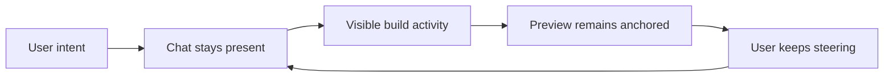

## Summary

Pave's core builder problem was not "where does the prompt box go?" It was how to keep the user, AI, and generated app connected after the first prompt.

The building loop became the central interaction model: chat stays present, build activity becomes visible, app preview remains anchored, and the user can keep steering without feeling like they moved into a separate tool.

## Project frame

- Role: product designer / design engineer.
- Surface: builder workspace, chat panel, preview panel, build-state components, app chrome.
- Timeframe: January through April 2026, with later mobile and workflow refinements.
- Source evidence: Builder page, ChatWindow composite, SubagentBubble, workflow preview work, branch-previewed prototype history.

The true origin is January 27, 2026. The initial builder shell landed in one commit: `BuilderPage`, `ChatWindow`, `ChatInput`, `SlashCommandMenu`, `TemplateEditor`, `PreviewPanel`, and `AppHeader`.

## Reviewer takeaway

The structural decision was that Pave should not treat AI chat as an onboarding step. Chat, build activity, and preview needed to behave like different views of the same work.

## Problem

Most AI builders make first generation impressive. The failure starts one step later.

The user gets an app-shaped artifact, but the conversation that created it feels separate from the thing they now need to understand, adjust, and trust. If chat dominates, the product feels like a chatbot. If canvas dominates, AI feels like a setup wizard that disappears.

> Chat should stay available, but the generated app should stay visually present.

## Shape

The builder used a split workspace: chat on the left, preview on the right, build-state components appearing inside the conversation.

Neither side could fully win. Chat needed enough room for conversation history, clarifying prompts, build steps, and plan cards. Preview needed enough presence to keep the user grounded in the actual app being created.

The app chrome also had to become a contract. The archive calls out fixed navigation and shell constraints: 256/72 sidebar behavior, 40px nav items, 56px header, and realm-level theme changes that require confirmation.

## Build activity as product state

Early `SubagentBubble` work mattered because it gave Pave a way to show AI work without turning the product into a log viewer.

The builder needed to communicate:

- something is happening
- work has steps
- the app is being shaped from the user's intent
- the user can return to steering after the system finishes

That is a narrow line. Too little activity feels opaque. Too much activity feels like fake technical theater.

## Mobile constraint

The later mobile-responsive pass mattered because the loop could not collapse into monetization or navigation. On small viewports, credit nudges above the message input were hidden so the primary builder input kept priority.

## What moved out

This page does not own every chat object. Planning objects have their own study: [Pave - Planning](/case-studies/pave-planning/).

It also does not own local canvas editing. That belongs in [Pave - Direct Edit](/case-studies/pave-direct-edit/).

## Outcome

The building loop became the core expression of Pave: prompt, build, preview, steer, continue. It made AI feel present without letting the app disappear behind conversation.

This is a product-structure story. The archive supports the implementation chronology and interaction decisions, but not measured builder-completion impact yet.

## Read next

- [Pave - Planning](/case-studies/pave-planning/) - review layer before generation runs too far.
- [Pave - Direct Edit](/case-studies/pave-direct-edit/) - local editing model after generation.
- [Designing Pave](/case-studies/designing-pave/) - broader product narrative.

