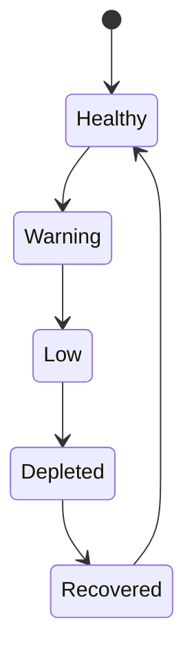

## Summary

Credits were not only a billing detail. In an AI builder, credits sit directly between user intent and system action. If the limit appears only when work stops, the product feels unfair.

The design problem was to make usage, limits, depletion, upgrade, and recovery understandable without interrupting the builder loop more than necessary.

## Project frame

- Role: product designer / design engineer.
- Surface: credit warning cards, header pill, pricing, checkout, credit packs, billing account surfaces, chat recovery.
- Timeframe: March to April 2026.
- Source evidence: billing handoff, billing-credit-packs handoff, credit popover redesign, CreditUpgradeCard, pricing/checkout flows.

The archive corrects the chronology: billing and credits landed early in the Pave build. Credit-warning cards appear around March 26, 2026, and the credit purchase redesign was live by April 8.

## Reviewer takeaway

The credit system worked best when it behaved like product state, not a surprise paywall. It gave users escalating context and recovery paths where they were already working.

## Problem

AI products consume resources in ways users cannot always predict. If limits appear only at the moment of failure, the product feels unfair. If upgrade prompts appear too early or too loudly, the product feels like a funnel instead of a tool.

Pave needed to answer:

- How many credits do I have?
- When do they renew?
- Why am I seeing this warning?
- What can I do now?
- Can I keep my work moving?

## State machine

The core model was a four-state ladder:

- healthy
- warning
- low
- depleted

Each state mapped across the header pill, chat card, nudge banner, pricing, checkout, account billing, and recovery actions.

## Recovery in context

The strongest pattern was inline recovery inside chat. If a user hit a limit while building, a modal would break the product's main loop. A chat card could explain the state and offer next steps without pretending the work context disappeared.

The point was not to hide monetization. It was to make recovery feel connected to the task.

Depleted state also had to reassure the user that published apps kept running. That copy matters because the user needs to know whether this is a purchase problem, a work-loss problem, or an outage.

## Pricing and checkout

Billing expanded into plan tiers, monthly/yearly toggle, credit packs, checkout, billing address, payment form, success state, and plan preselection.

The same state machine had to survive across the product:

- persistent balance awareness
- escalating warning language
- account-level detail
- checkout recovery
- add-on credit packs

## Edge cases

The archive's billing-state diagram includes a 19-item edge-case list. The most important ones for the case study:

- Mid-build depletion policy.
- Stale cards after renewal.
- Guarding sends so chat actions cannot bypass credits.
- Near-renewal depleted state: if renewal is minutes away, do not push an unnecessary purchase.
- Negative credits and plan-downgrade math.
- Staggered interruption at 0 credits so the UI does not fire every warning surface at once.

## Outcome

Credits became a visible part of Pave's operating model. The work turned limits into something users could understand and recover from, instead of a hidden system that only appeared when the product said no.

This page should not claim conversion impact yet. The archive supports design decisions, launch timing, and state coverage, not measured billing conversion.

## Read next

- [Pave - Building Loop](/case-studies/pave-building-loop/) - where inline credit states appear during work.
- [Designing Pave](/case-studies/designing-pave/) - overall Pave MVP story.
- [Building Pave](/case-studies/building-pave-environment/) - handoff system behind billing specs.

