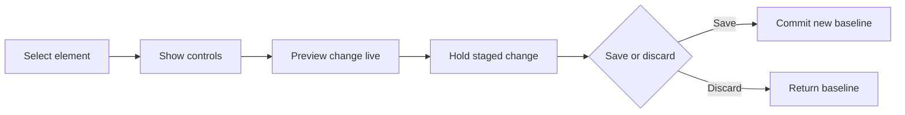

## Summary

Direct Edit answered a specific failure mode in AI builders: a user asks for a small change, AI regenerates too much, and something that was already right gets worse.

The design gave users a local editing path. Select an element, adjust properties, preview changes live, then save or discard. AI stayed available for semantic edits, but simple visual changes did not need to route through a prompt.

## Project frame

- Role: product designer / design engineer.
- Surface: InspectorCanvas, selection overlay, toolbar, spacing editor, component-specific panels.
- Timeframe: April through June 2026.
- Source evidence: visual-edit handoff, competitive analysis, editable-state research, spacing-editor research, inspector production pass, stage-aware suggestions.

Direct Edit matures from April 29 through June 9, 2026 in the archive. The supporting Confluence evidence includes Direct Edit PRD and related visual-edit research.

## Reviewer takeaway

The important move was not adding a toolbar. It was creating a safer editing contract for AI-generated output: local, staged, inspectable, reversible.

## Problem

Prompting is powerful for semantic change. It is weak for small deterministic edits.

`Make this heading smaller` should not require regenerating the page. `Give this card less padding` should not risk changing the table below it.

For generated software to feel trustworthy, users need a direct path for local changes.

## Research scale

The archive includes a 12-tool competitive audit across AI builders and design tools, plus a follow-on research set totaling roughly 4,600 lines. Competitors included Bolt, Figma Make, Base44, Lovable, v0, Webflow, Framer, Wix Studio, Cursor, Softr, and others.

That research supported a specific conclusion: the unit of direct manipulation was the element, not the page section.

## Editing model

Direct Edit used three layers:

- selection grammar: hover, selected, dirty, multi-selected
- controls: universal toolbar plus component-specific settings
- staged changes: live preview before save

## Shipped details

The proof layer matters here because a generic inspector would be easy to describe and hard to trust.

The archive calls out:

- ElementType expanding from 4 to 9.
- 9 chart types and 6 palettes.
- 26 `--dc-*` tokens.
- 40px floating toolbar.
- 320-640px component panel.
- 2,500ms two-step delete window.
- z-index range 9998-10002 for overlay layers.

The interaction included a Design/Prompt toggle, dirty dot, dashed dirty outline, `1 unsaved change` bar, and a two-step delete confirmation.

## Why staged changes mattered

Staged changes were a psychological safety decision.

Immediate apply feels fast but asks users to remember undo. Staged edit asks users to remember save. For this audience, forgetting to save is less damaging than forgetting to undo a broken generated layout.

## What moved out

Planning belongs before generation. Direct Edit belongs after generation. This study should stay focused on what happens when the user is looking at generated UI and wants to change it safely.

## Outcome

Direct Edit made Pave feel less like prompt-and-hope and more like a controllable builder. It gave users a way to keep what worked, change what did not, and understand which edits were still pending.

This page should stay honest: the archive proves research depth, interaction model, and implementation detail, not measured adoption or task-success impact yet.

## Read next

- [Pave - Planning](/case-studies/pave-planning/) - review before generation.
- [Pave - Building Loop](/case-studies/pave-building-loop/) - where Direct Edit lives.

