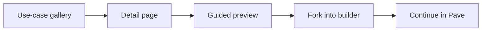

## Summary

Marketplace work extended Pave beyond a single prompt-to-app builder. It asked how users should discover, inspect, adapt, publish, and govern reusable app starts.

This is the post-launch ecosystem story: guided previews, realm review, policy-gated publishing, admin queue, use-case gallery, one-click starts, forked builder canvas, ComponentSpecs, HandoffHub, and reliable deep links.

## Project frame

- Role: product designer / design engineer.
- Surface: marketplace cards, guided previews, template detail, publishing/review flow, use-case gallery, forked builder canvas, handoff/spec pages.
- Timeframe: June 2026.
- Source evidence: marketplace Phase 1 / 1.1 screens, preview kit, realm review flow, onboarding funnel, ComponentSpecs, HandoffHub.

Source chronology: marketplace and the guided preview kit first appear around June 11, 2026. Onboarding funnels and forked-app builder canvas followed around June 17, and HandoffHub / ComponentSpecs work followed around June 25.

## Reviewer takeaway

This is not a template-gallery case study. The stronger story is governance and inspectability: reusable app starts should be previewed, reviewed, forked, and handed off with enough context to be trusted.

## Problem

Once Pave could generate apps, the next question was how people should start from existing intent.

A generic template shelf was too weak. Enterprise users need to know:

- what the app start does
- whether it fits their use case
- who approved it
- what happens when they open it
- whether they are copying, forking, publishing, or deploying

## Marketplace inspection

The design moved away from `Preview` as a vague action. The better behavior was closer to `Details`: inspect what this app start includes before carrying it into builder.

Guided previews needed to open real surfaces, not present a passive checklist.

## Governance

Marketplace also introduced enterprise governance:

- policy-gated publishing
- realm review
- admin queue
- management scaffolding
- approved, changes-requested, declined, published, and taken-down states

The important product move was turning a locked org decision into a policy. A fast realm could auto-publish. A governed realm could require review. The CTA had to be policy-aware: `Submit for review` is not the same promise as `Publish`.

## Forked builder entry

The strongest onboarding move was forked-app canvas. Instead of dumping a user into a blank builder after choosing a use case, Pave could carry the chosen starting point into builder context.

That makes the product feel continuous:

- find something relevant
- inspect it
- open it in builder
- adapt it with AI
- keep moving

## Preview confidence

The strongest archive language frames this as a preview confidence system, not decoration. Enterprise users should not commit a reusable app start based on icon cards and short descriptions.

The later thumbnail research also surfaced a security concern: preview images can leak real customer records, user names, emails, hostnames, or fetch fingerprints if captured casually. The proposed fix was a safe preview harness with persona-swapped identity, synthetic seed data, and fail-closed network rules.

## Handoff specs

ComponentSpecs, HandoffHub, and reliable deep links made marketplace work reviewable. PMs, designers, and engineers could land on exact states instead of reconstructing them from screenshots and comments.

This links back to [Building Pave](/case-studies/building-pave-environment/): marketplace is both product surface and proof that the design-delivery environment could handle multi-state work.

## Outcome

Marketplace work turned Pave from a single builder into a broader product ecosystem. It connected discovery, inspection, governance, handoff, and builder entry into one path.

The archive supports launch evidence around guided flows and marketplace branch work, but it does not include adoption or admin-validation telemetry yet. Keep this page framed as product-system and governance evidence, not market traction.

## Read next

- [Pave - Building Loop](/case-studies/pave-building-loop/) - where forked starts continue.
- [Building Pave](/case-studies/building-pave-environment/) - handoff/spec infrastructure behind this work.
- [Designing Pave](/case-studies/designing-pave/) - broader product story.

