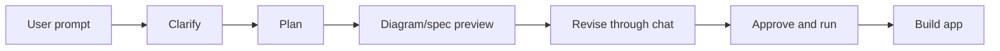

## Summary

Pave needed a step between prompt and generated app. Without it, the product could feel fast but reckless: the system would start building before the user understood what it planned to build.

Planning introduced reviewable artifacts into the AI loop: ClarifyCard, Plan Mode, WorkflowSpec, workflow diagram preview, revise-through-chat, and connection setup. These made generation steerable before it became expensive, confusing, or destructive.

## Project frame

- Role: product designer / design engineer.
- Surface: chat planning layer, workflow diagram preview, plan approval, clarification, connection setup.
- Timeframe: April 2026, with workflow work continuing after launch.
- Source evidence: Plan Mode commits, ClarifyCard, workflow-spec research, AI-native workflow-builder vision, ChatWindow composite.

One correction from the archive matters: Plan Mode was not a clean early standalone chapter. The first labeled Plan Mode feature appears on April 9, 2026, after the rebrand and alongside billing and ClarifyCard work. The portfolio story should keep that chronology honest.

## Reviewer takeaway

Planning made AI intent visible. Users could inspect the system's understanding, revise it, and approve execution instead of trusting a black-box jump from prompt to finished app.

## Problem

AI app builders often collapse intent, interpretation, and execution into one impressive demo moment. That is risky in an enterprise builder.

Users needed answers before generation:

- What does Pave think I asked for?
- What workflow will it create?
- What data or connection does it need?
- What can I change before it starts?
- What will happen when I approve?

## Planning objects

The planning layer should read as a set of trust artifacts, not a pile of components.

- `ClarifyCard`: asks scoped questions when the prompt is ambiguous.
- `PlanCard`: a reviewable plan object with its own template bank, portable outside one chat implementation.
- `WorkflowSpecCard`: a chat message that carries the workflow spec and keeps the thread as audit trail.
- `Workflow diagram preview`: shows trigger, condition, action, owner, and missing pieces before app UI appears.
- `Connection setup`: keeps external-system setup inside the building path instead of sending users to settings.

## Copy and control

Small copy decisions did real work here.

The specific call was `Approve & Run`. A second approval gate was deliberately rejected. The button had to say execution starts now without turning the flow into approval theater.

The PlanCard model carried eight lifecycle states: `generating-plan`, `plan-ready`, `generating-steps`, `draft`, `executing`, `paused`, `completed`, and `cancelled`. Those states mattered because motion, copy, footer actions, and progress indicators all needed to change together. A paused plan cannot keep shimmering like active work.

## Why diagrams mattered

A workflow diagram was not decoration. It was a way to show the user's future app logic before showing it as UI.

A generated dashboard can look polished while still encoding the wrong workflow. A diagram exposes structure earlier: trigger, condition, action, owner, connection, missing pieces.

## What moved out

This page should not carry the whole builder layout. Split workspace, build activity, and preview anchoring belong in [Pave - Building Loop](/case-studies/pave-building-loop/).

It should not carry local canvas editing either. That belongs in [Pave - Direct Edit](/case-studies/pave-direct-edit/).

## Outcome

Planning turned Pave's AI from one-shot generator into collaborator with inspectable intent. The work gave users a way to correct the system before it committed too much.

This is a design-evidence story, not a measured-adoption story yet. The archive supports the state model, review decisions, and implementation chronology. It does not include telemetry proving Plan Mode improved completion or reduced rework.

## Read next

- [Pave - Building Loop](/case-studies/pave-building-loop/) - workspace around planning layer.
- [Pave - Direct Edit](/case-studies/pave-direct-edit/) - editing generated result after planning.
- [Designing Pave](/case-studies/designing-pave/) - broader Pave thesis.

