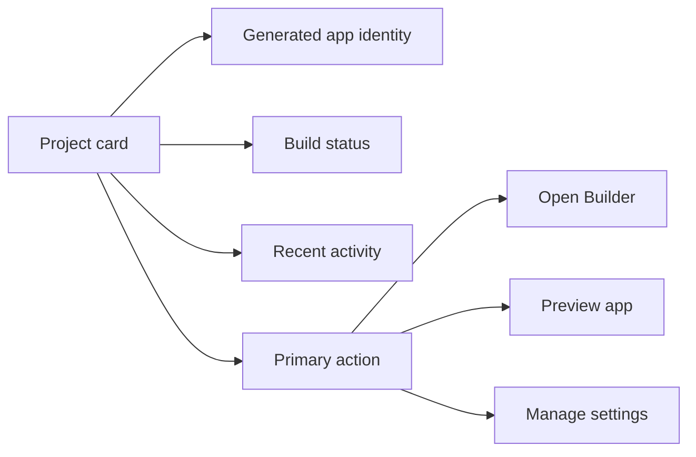

## The one-liner

Projects is the returning-user surface: not a file cabinet, not a dashboard wall, and not a place to teach the product. It is a compact command center for finding the thing you were building, understanding what state it is in, and getting back to work.

## About the product

Pave is an AI-native app builder. The Home page is intentionally prompt-first, so Projects has to carry the opposite job: continuity. It is where users return after the first build, compare multiple generated apps, recover unfinished work, and decide whether a project is ready to keep editing, share, or ship.

## How I framed the problem

The default project-list pattern is too weak for an AI builder. A generated app is not just a document with a name and timestamp. It has environment state, recent agent activity, credit implications, schema shape, deployment readiness, and a confidence problem: "What did the AI actually create, and can I trust this version?"

The design goal was to expose enough operational signal to make the list useful without turning it into a dense admin table. I wanted Projects to answer three questions in one scan:

- What did I build?
- What changed most recently?
- What can I safely do next?

## The shape I landed on

The page treats each project as a live object, not a static tile. The top-level card carries the app name, domain context, latest build status, and the next obvious action. Secondary metadata is deliberately quieter: environment, last edited date, owner, and credit-producing activity are useful, but they should not compete with the resume path.

The page also creates a clean handoff with Home. Home asks, "What do you want to make?" Projects asks, "Which thing do you want to continue?" Keeping those two questions on separate pages prevents the homepage from collapsing into a generic dashboard.

## Design decisions

- **Cards over a table.** A table would make sorting and batch actions easier, but it would underplay the app identity. Pave projects are generated products, not rows in an admin database.
- **Status as language, not decoration.** Build states need plain words: Draft, Building, Needs review, Live. Color is a secondary cue because state is too important to encode only in a pill tint.
- **Primary action per card.** The first button changes with state. A draft opens Builder; a live app opens Preview; a failed build opens the recovery path. Users should not have to parse a menu before doing the obvious thing.
- **Recent activity stays near the object.** Agent work, version changes, and deployment events belong on the project card instead of in a separate notifications drawer. Context is the value.
- **No marketing empty state.** The empty state should send the user back to the Home composer, not explain what Pave is.

## Screenshots

## What I gave up

- **No bulk operations.** The page is optimized for continuing one project, not managing hundreds. If Pave moves upmarket, this needs a table view or command palette path.
- **Search is under-specified.** A useful search needs to look across app names, table names, generated pages, and natural-language prompts. The current pattern only implies filtering.
- **No explicit version comparison.** The card points to recent activity, but it does not let users compare two generated versions side by side.
- **The ownership model is shallow.** Teams, sharing, and permissions are visible elsewhere in the product, but this page does not yet make collaborator state prominent.

## Open threads

- **Returning-user ranking.** Recency is not always relevance. A project with failed generation may deserve the top slot even if it is not the newest.
- **Trust signals.** There is room for a compact "ready to ship" checklist that summarizes unresolved issues without turning the card into a report.
- **Builder recovery path.** Failed or paused builds should deep-link to the exact chat turn and preview state where the interruption happened.
