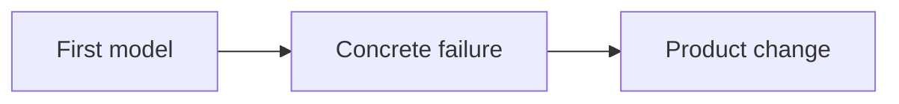

<!--
CASE-STUDY DRAFTING CONTRACT

Do not publish these notes. Use them to decide whether the story exists before polishing it.

1. What actually happened?
2. What did I initially believe, miss, over-design, or explain badly?
3. Which dated decision, broken state, artifact, quote-safe detail, or implementation constraint makes this my story?
4. What changed my interpretation?
5. What did I change in the product, system, or way of working?
6. Who else contributed, and what were they reasonably protecting?
7. What shipped, what remained a prototype, and what cannot be measured?
8. Which sentence is a little uncomfortable to admit?

If the source material cannot answer the first four questions, gather evidence instead of manufacturing a narrative arc.
-->

## {Begin with the incident, decision, or admission}

Start inside the work. Use a date, broken behaviour, scope cut, research moment, implementation failure, or honest admission when the evidence supports it. Do not open with a universal lesson or a polished product thesis.

Develop the paragraph. Let the first interpretation be incomplete. Alexander should be implicated before the study criticises a process, stakeholder, inherited system, user, engineer, or tool.

## The project

- Role: {precise ownership}
- Timeframe: {real dates or duration}
- Team: {contributors and partners}
- Status: {what shipped, what did not, and whether images are production or prototype}

Attribute shared work. Remove confidential names and details; do not blur somebody else's contribution into “I led”.

## {What looked true at first}

Explain the attractive first model. Why did it seem reasonable? What did the initial demo, research, artifact, or plan hide?

Keep the concrete mechanism close: an exact UI state, flow, branch, component, event, constraint, or awkward conversation. Tool names belong only when they explain the product consequence.

## {Where reality disagreed}

Show the failure or contradiction before announcing the correction. Name what broke, what the first explanation blamed, and which detail changed the interpretation.

Use a diagram only when the relationship or sequence is materially clearer than prose:



Use `case-stat` only for real, attributable measurements. Targets must be labelled as targets; usage is not proof of causation.

```case-stat title: Measured evidence
{real value} | {plain label} | {source, period, and limitation}
```

Use `case-quote` only for a real quote or a genuinely used project rule, not a sentence invented to make the page quotable.

```case-quote
attribution: {real source}
role: {context}
{Quote or rule used during the work.}
```

## {What changed}

Explain the chosen behaviour, state model, scope cut, architecture boundary, or operating rule. Include alternatives only when they were genuinely considered. Say why the rejected version was attractive before explaining why it lost.


## {The ugly or boring part that mattered}

Include edge cases, permissions, recovery, measurement, accessibility, maintenance, rollout, handoff, or organisational friction when they changed the result. Do not let the case study stop where the demo stops.

## What exists now

Separate facts cleanly:

- Shipped: {verifiable behaviour and date}
- Prototype: {working but unshipped behaviour}
- Measured: {real signal with source and period}
- Unknown: {missing evidence or inaccessible data}

Remove categories that do not apply. Do not convert internal targets into outcomes.

## {What remains unresolved}

End with the limitation, open question, measurement hole, or decision you would change. Keep the conclusion proportional to the evidence. No universal maxim, quote-card reversal, or engagement question.

<!--
FINAL ANTI-SLOP PASS

Rewrite when three or more are true:
- The opening already knows the conclusion.
- The turn arrives before a specific incident.
- Adjacent paragraphs are isolated for artificial weight.
- The prose leans on tidy symmetry or three-part rhetoric.
- I am wiser than everyone from line one.
- The details could fit any company.
- The ending sounds good on a quote card.
- Nothing costs me any pride.

Renderer note: this is a line-based custom MDX dialect. Do not rely on nested lists, tables, imports, or arbitrary HTML passthrough.
-->
