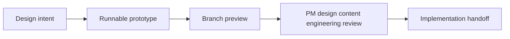
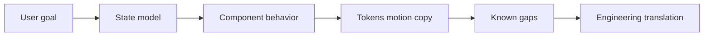

## I got tired of narrating the missing behaviour

In static design files I kept explaining motion, loading, dark mode, responsive behaviour, and the exact moment a state changed *beside* the screen. The annotations were becoming a parallel product - one that only worked while I was presenting it.

So I built a shared prototype repo and put the behaviour in the browser. This solved the narration problem and immediately created another one: AI could make the prototype grow fast enough that hardcoded colours, invented spacing, undocumented states, and broad “helpful” edits multiplied before review. Some screens looked far more certain than the thinking behind them. Mine included.

The companion case study, [Designing Pave](/case-studies/designing-pave/), covers the product itself. This one is about how I made and shared the work.

## The repo needed brakes as much as speed

The repo had to do two jobs that did not naturally arrive together:

- Let designers make detailed, runnable prototypes.
- Keep the output constrained enough that product, engineering, content, and design could review the same thing.

Without the second job, I had simply built a faster way to make disposable UI slop.



## A URL somebody else could argue with

The intended loop was simple:

1. Create a focused branch.
2. Ask an agent for a constrained UI or documentation change.
3. Keep styling inside the token system.
4. Run the local app.
5. Push the branch.
6. Share a browser preview and handoff artifact for review.

An agent writing React only mattered because it shortened the distance between an idea and something the team could disagree with in a real browser, without asking an engineer to translate every intermediate design thought.

The review link was a URL, not a screenshot. Anyone could inspect hover, focus, motion, dark mode, responsive behaviour, and state changes directly.

## What the prototype was allowed to pretend

The repo expressed behaviour, states, motion, copy, tokens, flows, and handoff intent. It did not get to pretend it had solved authentication, persistence, API contracts, observability, or backend architecture.

I had to repeat that limit because runnable code has a strange authority. I did not need a durable data layer to explore the workflow builder; I needed the intended behaviour to be clear when an engineer or product manager opened the page. The distinction is obvious in writing and remarkably easy to blur in a polished demo.

The environment optimized for three things:

- Runnable demos that reviewers could use, not just inspect
- Token consistency that made visual decisions systematic
- Enough written context that engineers did not have to reconstruct the behaviour from screenshots

## Generated UI loves inventing one more grey

The prototype UI was governed by a semantic token system. Components asked for purpose, not raw values: surface, text, border, spacing, radius, motion duration, and accent roles.

I treated tokens as rules, not a decorative theme file. The most useful one was:

> If a required style value does not exist as a token, stop and name the missing token instead of improvising one.

This stopped the slow drift I kept seeing: one component introduced a slightly different grey, another added a one-off radius, and a third invented an animation duration because apparently 180ms had offended it.

Light and dark mode used the same semantic contract. Components were designed to ask for roles rather than hardcoded theme values, which made dark-mode review and later brand changes less expensive.

The Blinq-to-Pave rebrand tested the system properly. I changed token values, logos, fonts, and documentation instead of restyling every screen.

## The generalist agent was a menace

I split AI work into narrow responsibilities:

- Product/design strategy work should not casually rewrite implementation details.
- Frontend implementation should not casually invent product copy.
- Motion work should respect reduced-motion expectations.
- Content work should keep strings auditable.
- Handoff work should capture state, props, behavior, tokens, and gaps.
- Design QA should check tokens, dark mode, accessibility, and interaction quality.

The generalist version was eager and dangerous. Ask for a loading state and it might also improve the copy, reorganise the component, add a dependency, and tidy documentation nobody had asked it to touch. Narrow lanes reduced the blast radius.

The names and routing changed as I worked, but the division of responsibility stayed useful.

## Adding checks before review

The environment treated design-system compliance as part of quality, not as cleanup.

The intended guardrail stack included:

- A repo-level agent contract for scope, diff discipline, and definition of done
- A generation context for React, CSS, tokens, component structure, copy, and motion rules
- Token docs and a canonical token source
- Motion guidelines and reduced-motion expectations
- Content guidelines for UI strings and review language
- Build and review checks that made violations visible before handoff

Not every check was automated. The contract still mattered because “please be careful” is not a system, however beautifully prompted.

## Screenshots kept hiding the failures

Static screenshots are useful, but they hide the parts of product design that usually matter in AI tools: hover states, focus behavior, loading motion, review gates, dark mode, and responsive friction.

Each branch could become a working page that a designer, product manager, writer, or engineer could open and inspect.

The preview answered one practical question:

> Can this design intent be reviewed without local setup?

## The screen was the wrong handoff unit

The production handoff needed to survive without me narrating every decision live.

A behavior package became the useful handoff unit:

- User goal
- State model
- Component behavior
- Motion and reduced-motion expectations
- Token usage
- Copy notes
- Edge cases
- Known gaps
- File or component index



The prototype showed what happened in the browser; the handoff explained the state, tokens, edge cases, and gaps behind it.

Plan Mode was the clearest example.

Plan Mode grew on `rebrand/blinq-to-pave` alongside brand migration, builder behaviour, and planning interactions. The branch was noisy. The handoff had to separate product intent from that noise instead of pretending the implementation history had been tidy.

The defining delivery package had three parts:

- Engineer handoff: the PlanCard lifecycle, state table, component behavior, and implementation notes
- PM/content preview brief: copy inventory, review prompts, and design-review feedback
- Flow diagram: the Plan Mode sequence from generation through approval and execution

The load-bearing part of the handoff was the `PlanStatus` model:

- `generating-plan`: Pave is drafting the plan; there is nothing to approve yet.
- `plan-ready`: the plan can be reviewed, but execution has not started.
- `generating-steps`: Pave is turning the approved plan into steps.
- `draft`: the plan exists as an object the person can review.
- `executing`: work is running and progress remains visible.
- `paused`: execution and progress motion both stop.
- `completed`: the work has resolved and the available actions change.
- `cancelled`: the plan exits without pretending that it completed.

Without the list, an engineer would have had to reverse-engineer product state from animation: which heading appears, which buttons exist, when shimmer runs, and why `paused` must not sit there cosplaying as `executing`.

Engineers used the repo, handoff, and diagram. Product and content used the preview and a shorter review brief. That brief also recorded feedback from April 9, 2026 and what happened to each comment, so decisions did not disappear into chat.

`SubagentBubble` sat inside the Plan Mode work. It showed small pieces of progress without turning the interface into a log. This was exactly the kind of detail that disappeared in a static handoff.

## Helping another designer use it

The workflow only mattered if non-engineers could use it.

The onboarding path was designed around a small repeatable unit:

1. Clone the repo and run the app.
2. Create a focused design branch.
3. Ask the agent for a scoped UI change.
4. Verify locally in light and dark mode.
5. Push the branch.
6. Share the preview and handoff notes for review.

The starter prompt showed the shape of a good request:

```bash
Use the frontend lane.
On the Connections page, add a short welcome banner.
Use existing tokens for background, text, spacing, and radius.
Verify light and dark mode.
Do not add dependencies or change route structure.
```

I only ran this as an internal pilot. I did not measure onboarding time or validate it with a wider group of non-coding designers.

## Limits of the pilot

The environment made Pave easier to build and discuss. Tokens constrained the visual language, narrow agent lanes limited accidental edits, branch previews exposed actual behaviour, and the handoffs recorded what the browser could not explain. Engineers used the repo and the Plan Mode package; product and content could review a shorter preview brief.

I only ran the non-coding-designer workflow as an internal pilot. I did not measure onboarding time or prove that another designer could use it without me hovering nearby, which is awkward for a system partly designed to remove me as interpreter.

The next version needs boring numbers: time from idea to review, token violations, review rounds, and completion without author support. Until then it is a useful working environment, not evidence that I reinvented design delivery.

## Related work

- [Designing Pave](/case-studies/designing-pave/) - the product surfaces this environment made possible.
- [Design systems and AI-augmented practice](/case-studies/design-systems-ai-practice/) - the broader machine-readable design-system and human review model.
