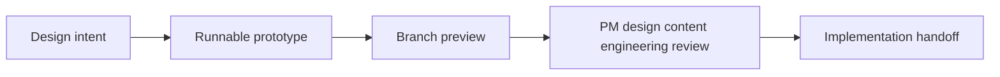
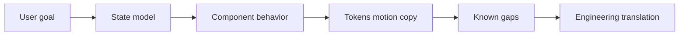

## The one-liner

Pave was not only a product prototype. It was also a design environment: a repo where designers could express product intent through runnable code, review working branch previews, and hand off behavior instead of static screens.

The companion case study, [Designing Pave](/case-studies/designing-pave/), covers the product surfaces. This one covers the operating system behind them.

## Why the environment mattered

AI-assisted design work can move quickly, but speed creates its own failure modes: hardcoded colors, inconsistent spacing, undocumented state, overbroad edits, unclear ownership, and prototypes that look more production-ready than they are.

For Pave, the environment had to support two jobs at once:

- Let designers and agents produce high-fidelity, runnable product intent.
- Keep that work constrained enough that engineering, PM, content, and design QA could trust what they were reviewing.

That is the difference between a one-off prototype and a repeatable design workflow.



## Evidence boundary

This public portfolio repo includes the exported case-study surfaces, screenshots, and preview components. Some source-repo artifacts behind the workflow, including private handoff docs, internal branch history, workflow logs, and agent definitions, are not published here.

So this case study is careful about claim strength:

- I make hard claims where the public case-study material can show the artifact.
- I describe private operational material as workflow design unless it can be shown safely in a redacted form.
- I treat the prototype repo as a design-intent environment, not a production architecture reference.

That boundary matters. A hiring reviewer should be able to trust the story without needing access to confidential repositories.

## The loop I wanted

The intended loop was simple:

1. Create a focused branch.
2. Ask an agent for a constrained UI or documentation change.
3. Keep styling inside the token system.
4. Run the local app.
5. Push the branch.
6. Share a browser preview and handoff artifact for review.

The value was not that an agent could write code. The value was that a designer could turn intent into a reviewable product object without asking engineering to translate every intermediate idea.

In the strongest version of the workflow, the review artifact is a URL, not a screenshot. Reviewers can inspect hover, focus, motion, dark mode, responsive behavior, and state transitions directly.

## Design-intent prototype, not production architecture

The repo was meant to express what to build: behavior, states, motion, copy, tokens, flows, and handoff intent. Production concerns such as auth, persistence, API contracts, observability, and backend architecture belonged elsewhere.

That constraint was useful. I did not need to build a durable data layer to prove the workflow builder. I needed a working surface that made the intended product behavior legible to engineers and stakeholders.

The environment optimized for three things:

- Runnable demos that reviewers could use, not just inspect
- Token consistency that made visual decisions systematic
- Extractable intent that production engineers could implement without reconstructing the design from screenshots

## Token-governed UI

The prototype UI was governed by a semantic token system. Components asked for purpose, not raw values: surface, text, border, spacing, radius, motion duration, and accent roles.

That decision turned tokens from a theme file into a governance surface. The useful rule was not merely "use CSS variables." It was:

> If a required style value does not exist as a token, stop and name the missing token instead of improvising one.

That rule reduces the drift pattern that usually appears in generated UI: one component introduces a slightly different color, another adds a one-off radius, a third creates a bespoke duration, and the system slowly loses its shape.

Light and dark mode used the same semantic contract. Components were designed to ask for roles rather than hardcoded theme values, which made dark-mode review and later brand changes less expensive.

The Blinq-to-Pave rebrand was the useful proof point. A brand migration could be expressed through token values, logo usage, font decisions, and documentation rather than through isolated per-screen restyling.

## Specialist agent lanes

The workflow was organized around narrow agent responsibilities. The important principle was not the exact tool name. It was the boundary:

- Product/design strategy work should not casually rewrite implementation details.
- Frontend implementation should not casually invent product copy.
- Motion work should respect reduced-motion expectations.
- Content work should keep strings auditable.
- Handoff work should capture state, props, behavior, tokens, and gaps.
- Design QA should check tokens, dark mode, accessibility, and interaction quality.

Narrow lanes reduce the failure mode where a generalist agent changes layout, copy, state, dependencies, and docs in one broad pass.

The source repo used named agent roles and routing conventions for this work. I keep exact agent count and routing claims out of the public prose unless I can pair them with a redacted excerpt of those definitions.

## Guardrails and review gates

The environment treated design-system compliance as part of quality, not as cleanup.

The intended guardrail stack included:

- A repo-level agent contract for scope, diff discipline, and definition of done
- A generation context for React, CSS, tokens, component structure, copy, and motion rules
- Token docs and a canonical token source
- Motion guidelines and reduced-motion expectations
- Content guidelines for UI strings and review language
- Build and review checks that made violations visible before handoff

Some of those artifacts are referenced by the case-study system but are not included in this public snapshot. That means the public prose should not overclaim exact automation unless the workflow YAML, scripts, or logs can be shown.

The safer claim is still strong: the environment was designed so that agents worked inside an explicit contract instead of free-form prompt improvisation.

## Branch previews as the review surface

Static screenshots are useful, but they hide the parts of product design that usually matter in AI tools: hover states, focus behavior, loading motion, review gates, dark mode, and responsive friction.

The branch-preview model made the working URL the review artifact. A branch could become a browser surface that a designer, PM, content partner, engineer, or design QA reviewer could open and inspect.

In the source workflow, branch previews were designed to answer a practical question:

> Can this design intent be reviewed without local setup?

For public proof, the strongest artifacts are a redacted workflow excerpt, a preview index screenshot, a preview banner screenshot, and one safe example of the branch URL pattern.

## Handoff grammar

The production handoff needed to survive without me narrating every decision live.

The useful handoff unit was not a screen. It was a behavior package:

- User goal
- State model
- Component behavior
- Motion and reduced-motion expectations
- Token usage
- Copy notes
- Edge cases
- Known gaps
- File or component index



This is where spec-driven development became useful. The prototype was an executable product spec: reviewers could use the behavior in a browser, then read the handoff to understand the state and implementation intent behind it.

The clearest proof was Plan Mode.

Plan Mode did not live on a neat one-feature branch. It was built incrementally on the `rebrand/blinq-to-pave` branch, where brand migration, builder behavior, and planning interactions were moving together. That made the handoff system more important, not less: the feature needed a way to separate product intent from branch noise.

The defining delivery package had three parts:

- Engineer handoff: the PlanCard lifecycle, state table, component behavior, and implementation notes
- PM/content preview brief: copy inventory, review prompts, and design-review feedback
- Flow diagram: the Plan Mode sequence from generation through approval and execution

The handoff's load-bearing artifact was the `PlanStatus` state model:

| State | What it clarified |
|---|---|
| `generating-plan` | The system is drafting the plan before the user can approve it. |
| `plan-ready` | The plan can be reviewed, but execution has not started. |
| `generating-steps` | The system is expanding the approved plan into executable steps. |
| `draft` | The plan exists as a reviewable object. |
| `executing` | Work is actively running and progress indicators remain visible. |
| `paused` | Execution stops, including motion states that should no longer imply progress. |
| `completed` | The plan has resolved and the footer/action model changes. |
| `cancelled` | The plan exits without pretending work completed. |

That table replaced ambiguity. Without it, an engineer would have had to reverse-engineer behavior from the prototype animation alone: which header text appears, which footer buttons are available, when shimmer is active, when dot pulse is allowed, and why paused should not look like executing.

The same package separated reviewer needs. Engineers used the repo, handoff doc, and diagram to understand implementation behavior. PM and content reviewers used the preview URL and preview brief to inspect the live branch without running the app locally. The preview brief also captured design-review feedback from April 9, 2026 and tracked each item to a resolution, turning review comments into part of the delivery artifact instead of side-channel memory.

SubagentBubble was a nested pattern inside this Plan Mode work, not a separate case-study feature. It made AI activity feel granular and observable inside plan steps without turning the interface into a log stream. It mattered because the environment was trying to preserve fidelity that screenshots usually lose: small progress states, hover behavior, motion, and the feeling of work unfolding inside the builder.

## Designer onboarding

The workflow only mattered if non-engineers could use it.

The onboarding path was designed around a small repeatable unit:

1. Clone the repo and run the app.
2. Create a focused design branch.
3. Ask the agent for a scoped UI change.
4. Verify locally in light and dark mode.
5. Push the branch.
6. Share the preview and handoff notes for review.

The starter prompt was the load-bearing artifact. It taught the shape of a good request:

```bash
Use the frontend lane.
On the Connections page, add a short welcome banner.
Use existing tokens for background, text, spacing, and radius.
Verify light and dark mode.
Do not add dependencies or change route structure.
```

I frame onboarding results as an internal pilot unless there is a redacted PR, timestamp, or participant note that can safely support a stronger validation claim.

## Private walkthrough appendix

Some proof is better suited to a hiring walkthrough than a public page.

The strongest appendix includes:

- Branch preview index and preview banner screenshots
- A redacted branch workflow excerpt
- A token-check failure and corrected diff
- A starter prompt from the designer quickstart
- A redacted handoff page showing state, props, tokens, motion, edge cases, and open questions
- A before/after rebrand token or logo excerpt

Those artifacts make the tooling story concrete without exposing internal strategy, customers, metrics, or unreleased roadmap work.

## Claims I keep bounded

The original version of this story made some operational claims too hard for a public portfolio page unless the supporting artifacts were shown.

I keep these claims soft unless I can show proof:

- Exact deploy timing
- Exact agent count and routing behavior
- CI and pre-commit implementation details
- Claims that every branch deployed automatically
- Claims that onboarding was validated by non-coder designers

The story does not need those claims to be impressive. The stronger point is that the environment turned AI-assisted design from a one-off trick into a governed workflow with reviewable outputs.

## What this shows

The Pave environment turned the design system into a workflow.

Tokens defined the visual vocabulary. Agent lanes constrained the work. Branch previews made behavior reviewable. Handoffs preserved implementation intent. The prototype made product decisions executable without pretending to be the production architecture.

The result was not simply that AI wrote code faster. The result was that AI-assisted design work happened inside a system that could keep saying what counted as good.

## Evidence links

- [Designing Pave](/case-studies/designing-pave/) - the product surfaces this environment made possible.
- [Pave - Building Loop](/case-studies/pave-building-loop/) - supporting artifact for the flagship AI app builder surface.
- [Pave - Direct Edit](/case-studies/pave-direct-edit/) - supporting artifact for direct-edit behavior.
- [Pave billing](/case-studies/pave-billing/) - supporting artifact for credits, pricing, and checkout.
