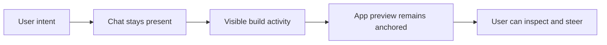
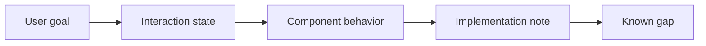

## Summary

Pave was Quickbase's bet that AI-assisted app building could move beyond prompt-to-prototype and become a practical way for enterprise teams to create real, usable software.

I was the sole product designer through the first six months of the MVP push. My work shaped the foundational product experience across the builder, authentication flow, chat input, project builder layout, navigation, theme selector, and build-state components.

Pave [launched publicly on April 28, 2026](https://www.quickbase.com/news/press-releases/quickbase-announces-pave). Quickbase positioned it as a full-stack AI app builder for enterprise teams: a product where people describe what they need, shape the generated app, and put it to work with roles, publishing, and hosted infrastructure around it.

The design challenge was:

> Make AI app creation feel fast without making it feel reckless.

That meant the generated app could not be the only important moment. Users also needed to understand what was happening, stay connected to the output, recover from mistakes, and trust that the product was more than a disposable demo.

## Project frame

- Role: sole product designer for the first six months of the MVP effort
- Timeline: six-month MVP push leading to public launch on April 28, 2026
- Team: fewer than ten people across senior product leadership, principal engineering, software architecture, executive stakeholders, marketing, branding, and content
- Status: publicly launched product direction, with some public portfolio examples shown as design-intent prototypes
- Confidentiality boundary: no internal metrics, customer details, roadmap dates, Jira or Confluence references, or unreleased feature screenshots

This case study covers the product-design story. The companion case study, [Building Pave](/case-studies/building-pave-environment/), covers the code-based design environment, branch previews, token guardrails, and handoff workflow behind the work.

## Why this was hard

Most AI app builders make the first generation feel impressive. A user types a prompt, the system produces an app-shaped artifact, and the demo works.

The harder product problem starts after that first generation.

Business users still need to understand what was created, edit the output, preserve what is already working, invite collaborators, publish changes, and trust that the product has a path toward real operational use. If chat disappears after generation, the product feels like an intake form. If the canvas takes over completely, the AI becomes an onboarding trick. If the AI keeps regenerating everything, users lose confidence in making small changes.

For Pave, the MVP needed to hold three tensions at once:

- Speed vs. control: generation should feel fast, but users still need to understand where they can intervene.
- Simplicity vs. enterprise reality: the first-run experience needed to stay light while pointing toward roles, publishing, infrastructure, and governance.
- Exploration vs. launch: early product exploration was broader than the first public MVP could responsibly ship.

## My role

I worked closely with a small senior team across product, engineering, architecture, executive stakeholders, marketing, brand, and content.

My contribution centered on four areas:

- Foundational product model: how app creation, builder, chat, preview, navigation, and project state connected
- Core launch surfaces: authentication, builder, chat input, project builder layout, navigation, theme selector, and build-state components
- Product clarity: diagrams, state maps, behavior specs, edge cases, accessibility notes, and design QA
- Future-state exploration: deeper planning, editing, configuration, and operational workflows that clarified where Pave could go after launch

Johnny Lee joined later and helped elevate the visual expression and ongoing product polish. Marketing, branding, and content shaped the final public-facing launch expression. My role was to establish the product foundation early enough that the team could converge, cut scope, and ship.

## What I can show

For this public version, I am intentionally separating the product story from confidential implementation details.

Shown here:

- Builder, chat, preview, and build-state interaction models
- Publicly safe screenshots and prototype surfaces
- How I used design-intent prototypes as executable product specs
- The kinds of product decisions the prototype made explicit

Not shown here:

- Internal metrics, customer details, roadmap dates, or launch targets
- Private product strategy, Jira or Confluence material, or unreleased screenshots
- Production architecture details that belong to the engineering codebase

Where I show prototype surfaces, the point is not that the prototype was production architecture. The point is that it made product behavior, state, motion, copy, and implementation intent concrete enough to review.

## Design strategy

I used four principles to keep the MVP coherent.

### Start from intent

The first interaction needed to begin with what the user wanted to build, not with a configuration sequence.

The desired posture was:

> Tell Pave what you need.

Not:

> Create a workspace, choose settings, configure an app, then begin.

That principle shaped the authenticated entry experience and the way the builder treated chat as a core product surface rather than a separate onboarding step.

### Keep chat and builder connected

The Builder was the center of the MVP because it answered the most important interaction question:

> Where does the AI live once the user starts building?

I wanted conversation and app creation to be two views of the same object. The builder brought together chat input, app context, build activity, preview, theme selection, publish-oriented actions, and navigation back into the broader app shell.

The important design detail was not just that the page used a split layout. It was that neither side was allowed to dominate. The user needed enough room to talk to the AI, but the app being created had to remain the anchor.

The split-pane model became a structural expression of the product thesis: AI should remain present as a collaborator, but the generated app should not disappear behind the conversation.

### Make AI activity visible

A spinner would not be enough.

When the system is building, users need a sense that work is happening in a structured way. I designed build-state patterns and subagent cards to make system activity legible without turning the product into a log viewer.

The principle was:

> Show enough system activity to keep the user oriented, but not so much that the interface becomes backend theater.

This supported perceived progress, trust during generation, and a clearer relationship between the user's prompt and the app taking shape.

### Cut scope without breaking the thesis

The April 28 public launch forced hard prioritization. Early explorations covered broader planning, editing, configuration, history, and operational workflows. Those explorations were useful because they clarified the long-term product direction, but they were too much for the first public MVP.

The real design work became reduction:

- Broad product possibility
- MVP product thesis
- Launchable interaction foundation
- Implementation-ready components

The question became:

> What has to remain true for the MVP to still feel like Pave?

For me, the answer was:

- Users can start from intent.
- Chat and building feel connected.
- The app surface remains visible and controllable.
- The product has a credible path toward real enterprise app creation.
- The experience is polished enough to support a public launch.

## Deep dive: Builder as the core proof

Builder carried the main product argument. It needed to avoid two failure modes: becoming just a chatbot, or becoming a visual editor where the AI disappears after generation.

The surface was designed around a connected loop:

1. User describes what they want.
2. Pave clarifies or plans when needed.
3. Build activity becomes visible.
4. The preview remains anchored.
5. The user can inspect, adjust, and continue the conversation.

That loop mattered more than any single component. It let the product feel fast while still giving the user a visible object to reason about.

The detailed Builder case study covers the split-pane mechanics, plan-review loop, preview swap, and staged inspector behavior: [Builder](/case-studies/pave-builder/).

## Supporting product systems

The companion feature studies show how the same design posture carried into smaller surfaces.

### Chat and build states

The chat system was not treated as a generic message list. It had to represent product moves: clarification, planning, build execution, visible subagent activity, plan review, and completion.

This made the conversation history more than a transcript. It became an audit trail of product intent and system action.

### Inspector and direct edit

Generated output needed a local editing model. If every correction routes through a prompt, users can lose the work that was already right.

The Inspector explored a staged-change model: users select an element, make deterministic changes, preview them live, and explicitly save or discard. That gave small edits a safer path than regeneration.

See [InspectorCanvas](/case-studies/pave-inspector-canvas/) for the selection grammar, overlay behavior, spacing editor, and open production questions.

### Notifications, billing, and rebrand

Notification setup, billing states, and the Blinq-to-Pave rebrand were useful because they tested whether the design system could handle real product complexity:

- Notification builder: rules, triggers, conditions, recipients, template adjacency, and save behavior
- Billing: pricing, checkout, account billing, credit warnings, and upgrade paths across multiple surfaces
- Rebrand: tokens, logo usage, fonts, colors, documentation, and dark-mode resilience

I do not lead this case study with those examples because Builder is the clearer expression of Pave's core product thesis. They work better as supporting proof that the same design and handoff approach could scale across product areas.

## Executable product specs

Because the team was small and senior, static mockups were not enough.

The design needed to answer implementation questions:

- What are the states?
- What changes before, during, and after generation?
- How does navigation behave?
- Which components are reusable?
- Which parts are launch-critical?
- Which parts can be deferred?
- Where are the known gaps?

I used runnable prototypes and structured notes as part of the design work. The useful artifact was not a pile of screenshots; it was a product behavior model that made user goal, interaction state, component behavior, implementation note, and known gap visible.

That helped the team avoid treating design as a pile of screens. It made the product easier to reason about and helped implementation conversations stay grounded in behavior.

The companion environment case study explains the code-based handoff system behind that workflow.

## Outcome

Pave launched publicly on April 28, 2026.

I am not sharing internal product metrics. The public impact I can safely describe is qualitative:

- Product impact: I established a prompt-first builder model where chat, build activity, preview, navigation, and product state worked together as one loop.
- Execution impact: the design work made product behavior reviewable through prototypes, diagrams, and implementation-oriented handoffs.
- Strategic impact: the MVP clarified that AI-assisted app creation needed to become more understandable, controllable, and operationally useful after the initial generation moment.

## Reflection

The biggest lesson from Pave was that AI product design is not only about the generation moment.

The impressive demo is the easy part. The hard part is everything around it:

- Helping users understand what the system is doing
- Giving them enough control to trust the output
- Preserving the relationship between prompt and app
- Making product state visible
- Cutting scope without breaking the thesis
- Helping engineering understand the design well enough to ship it

Using code helped make behavior concrete. It made states, motion, layout, copy, and component intent easier to evaluate. It also created a real tension: a design-intent prototype can look production-ready when it is not.

The better framing was:

> The prototype was not the production architecture. It was a working design artifact that made behavior, state, and intent easier to implement.

Looking back, I would have created an even clearer shipped-versus-exploratory map earlier. Some explorations were intentionally broader than launch scope, and the team needed sharp boundaries between what we were shipping, what we were validating, and what we were using to clarify direction.

But the core product model held. Pave needed to feel fast, but not reckless. It needed to make AI feel powerful, but not opaque. And it needed enough structure for a small team to move from ambiguity to a public MVP in six months.

## Read next

- [Building Pave](/case-studies/building-pave-environment/) - the design environment and AI-assisted workflow behind the product work.
- [Builder](/case-studies/pave-builder/) - the flagship AI app builder surface.
- [InspectorCanvas](/case-studies/pave-inspector-canvas/) - the direct-edit composite.
- [Pave billing](/case-studies/pave-billing/) - credits, pricing, and checkout.
